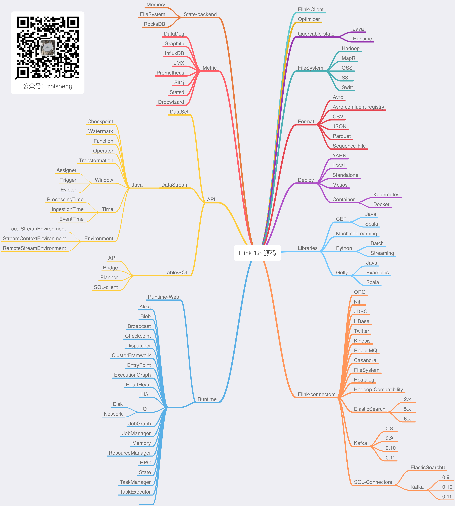

# Flink 学习

麻烦路过的各位亲给这个项目点个 star，太不易了，写了这么多，算是对我坚持下来的一种鼓励吧！


## Stargazers over time


## 本项目结构


## How to build

Maybe your Maven conf file `settings.xml` mirrors can add aliyun central mirror :

```xml
<mirror>
  <id>alimaven</id>
  <mirrorOf>central</mirrorOf>
  <name>aliyun maven</name>
  <url>https://maven.aliyun.com/repository/central</url>
</mirror>
```

then you can run the following command :

```
mvn clean package -Dmaven.test.skip=true
```

you can see following result if build success.


## Flink 系统专栏

基于 Flink 1.9 讲解的专栏，涉及入门、概念、原理、实战、性能调优、系统案例的讲解。扫码下面专栏二维码可以订阅该专栏


首发地址：[http://www.54tianzhisheng.cn/2019/11/15/flink-in-action/](http://www.54tianzhisheng.cn/2019/11/15/flink-in-action/)

专栏地址：[https://gitbook.cn/gitchat/column/5dad4a20669f843a1a37cb4f](https://gitbook.cn/gitchat/column/5dad4a20669f843a1a37cb4f)


## Change

2019/09/06 将该项目的 Flink 版本升级到 1.9.0，有一些变动，Flink 1.8.0 版本的代码经群里讨论保存在分支 [feature/flink-1.8.0](https://github.com/zhisheng17/flink-learning/tree/feature/flink-1.8.0) 以便部分同学需要。

2019/06/08 四本 Flink 书籍：

+ [Introduction_to_Apache_Flink_book.pdf]()    这本书比较薄，处于介绍阶段，国内有这本的翻译书籍

+ [Learning Apache Flink.pdf]()    这本书比较基础，初学的话可以多看看

+ [Stream Processing with Apache Flink.pdf]()    这本书是 Flink PMC 写的

+ [Streaming System.pdf]()  这本书评价不是一般的高

2019/06/09 新增流处理引擎相关的 Paper，在 paper 目录下：

+ [流处理引擎相关的 Paper](./paper/paper.md)

## 博客

1、[Flink 从0到1学习 —— Apache Flink 介绍](http://www.54tianzhisheng.cn/2018/10/13/flink-introduction/)

2、[Flink 从0到1学习 —— Mac 上搭建 Flink 1.6.0 环境并构建运行简单程序入门](http://www.54tianzhisheng.cn/2018/09/18/flink-install)

3、[Flink 从0到1学习 —— Flink 配置文件详解](http://www.54tianzhisheng.cn/2018/10/27/flink-config/)

4、[Flink 从0到1学习 —— Data Source 介绍](http://www.54tianzhisheng.cn/2018/10/28/flink-sources/)

5、[Flink 从0到1学习 —— 如何自定义 Data Source ？](http://www.54tianzhisheng.cn/2018/10/30/flink-create-source/)

6、[Flink 从0到1学习 —— Data Sink 介绍](http://www.54tianzhisheng.cn/2018/10/29/flink-sink/)

7、[Flink 从0到1学习 —— 如何自定义 Data Sink ？](http://www.54tianzhisheng.cn/2018/10/31/flink-create-sink/)

8、[Flink 从0到1学习 —— Flink Data transformation(转换)](http://www.54tianzhisheng.cn/2018/11/04/Flink-Data-transformation/)

9、[Flink 从0到1学习 —— 介绍 Flink 中的 Stream Windows](http://www.54tianzhisheng.cn/2018/12/08/Flink-Stream-Windows/)

10、[Flink 从0到1学习 —— Flink 中的几种 Time 详解](http://www.54tianzhisheng.cn/2018/12/11/Flink-time/)

11、[Flink 从0到1学习 —— Flink 读取 Kafka 数据写入到 ElasticSearch](http://www.54tianzhisheng.cn/2018/12/30/Flink-ElasticSearch-Sink/)

12、[Flink 从0到1学习 —— Flink 项目如何运行？](http://www.54tianzhisheng.cn/2019/01/05/Flink-run/)

13、[Flink 从0到1学习 —— Flink 读取 Kafka 数据写入到 Kafka](http://www.54tianzhisheng.cn/2019/01/06/Flink-Kafka-sink/)

14、[Flink 从0到1学习 —— Flink JobManager 高可用性配置](http://www.54tianzhisheng.cn/2019/01/13/Flink-JobManager-High-availability/)

15、[Flink 从0到1学习 —— Flink parallelism 和 Slot 介绍](http://www.54tianzhisheng.cn/2019/01/14/Flink-parallelism-slot/)

16、[Flink 从0到1学习 —— Flink 读取 Kafka 数据批量写入到 MySQL](http://www.54tianzhisheng.cn/2019/01/15/Flink-MySQL-sink/)

17、[Flink 从0到1学习 —— Flink 读取 Kafka 数据写入到 RabbitMQ](https://t.zsxq.com/uVbi2nq)

18、[Flink 从0到1学习 —— Flink 读取 Kafka 数据写入到 HBase](https://t.zsxq.com/zV7MnuJ)

19、[Flink 从0到1学习 —— Flink 读取 Kafka 数据写入到 HDFS](https://t.zsxq.com/zV7MnuJ)

20、[Flink 从0到1学习 —— Flink 读取 Kafka 数据写入到 Redis](https://t.zsxq.com/zV7MnuJ)

21、[Flink 从0到1学习 —— Flink 读取 Kafka 数据写入到 Cassandra](https://t.zsxq.com/uVbi2nq)

22、[Flink 从0到1学习 —— Flink 读取 Kafka 数据写入到 Flume](https://t.zsxq.com/zV7MnuJ)

23、[Flink 从0到1学习 —— Flink 读取 Kafka 数据写入到 InfluxDB](https://t.zsxq.com/zV7MnuJ)

24、[Flink 从0到1学习 —— Flink 读取 Kafka 数据写入到 RocketMQ](https://t.zsxq.com/zV7MnuJ)

25、[Flink 从0到1学习 —— 你上传的 jar 包藏到哪里去了](https://t.zsxq.com/uniY7mm)

26、[Flink 从0到1学习 —— 你的 Flink job 日志跑到哪里去了](https://t.zsxq.com/zV7MnuJ)


### Flink 源码项目结构




## 学习资料

另外我自己整理了些 Flink 的学习资料，目前已经全部放到微信公众号了。
你可以加我的微信：**yuanblog_tzs**，然后回复关键字：**Flink** 即可无条件获取到，转载请联系本人获取授权，违者必究。


更多私密资料请加入知识星球！


有人要问知识星球里面更新什么内容？值得加入吗？

目前知识星球内已更新的系列文章：

### 大数据重磅炸弹

1、[《大数据重磅炸弹——实时计算引擎 Flink》开篇词](https://t.zsxq.com/fqfuVRR​)

2、[你公司到底需不需要引入实时计算引擎？](https://t.zsxq.com/emMBaQN​)

3、[一文让你彻底了解大数据实时计算框架 Flink](https://t.zsxq.com/eM3ZRf2) ​

4、[别再傻傻的分不清大数据框架Flink、Blink、Spark Streaming、Structured Streaming和Storm之间的区别了](https://t.zsxq.com/eAyRz7Y)​

5、[Flink 环境准备看这一篇就够了](https://t.zsxq.com/iaMJAe6​)  

6、[一文讲解从 Flink 环境安装到源码编译运行](https://t.zsxq.com/iaMJAe6​)

7、[通过 WordCount 程序教你快速入门上手 Flink](https://t.zsxq.com/eaIIiAm)  ​

8、[Flink 如何处理 Socket 数据及分析实现过程](https://t.zsxq.com/Vnq72jY​)  

9、[Flink job 如何在 Standalone、YARN、Mesos、K8S 上部署运行？](https://t.zsxq.com/BiyvFUZ​)

10、[Flink 数据转换必须熟悉的算子（Operator）](https://t.zsxq.com/fufUBiA)

11、[Flink 中 Processing Time、Event Time、Ingestion Time 对比及其使用场景分析](https://t.zsxq.com/r7aYB2V) 

12、[如何使用 Flink Window 及 Window 基本概念与实现原理](https://t.zsxq.com/byZbyrb)

13、[如何使用 DataStream API 来处理数据？](https://t.zsxq.com/VzNBi2r)

14、[Flink WaterMark 详解及结合 WaterMark 处理延迟数据](https://t.zsxq.com/Iub6IQf)

15、[基于 Apache Flink 的监控告警系统](https://t.zsxq.com/MniUnqb)

16、[数据仓库、数据库的对比介绍与实时数仓案例分享](https://t.zsxq.com/v7QzNZ3)

17、[使用 Prometheus Grafana 监控 Flink](https://t.zsxq.com/uRN3VfA)


### 源码系列

1、[Flink 源码解析 —— 源码编译运行](https://t.zsxq.com/UZfaYfE)

2、[Flink 源码解析 —— 项目结构一览](https://t.zsxq.com/zZZjaYf)

3、[Flink 源码解析—— local 模式启动流程](https://t.zsxq.com/zV7MnuJ)

4、[Flink 源码解析 —— standalonesession 模式启动流程](https://t.zsxq.com/QZVRZJA)

5、[Flink 源码解析 —— Standalone Session Cluster 启动流程深度分析之 Job Manager 启动](https://t.zsxq.com/u3fayvf)

6、[Flink 源码解析 —— Standalone Session Cluster 启动流程深度分析之 Task Manager 启动](https://t.zsxq.com/MnQRByb)

7、[Flink 源码解析 —— 分析 Batch WordCount 程序的执行过程](https://t.zsxq.com/YJ2Zrfi)

8、[Flink 源码解析 —— 分析 Streaming WordCount 程序的执行过程](https://t.zsxq.com/qnMFEUJ)

9、[Flink 源码解析 —— 如何获取 JobGraph？](https://t.zsxq.com/naaMf6y)

10、[Flink 源码解析 —— 如何获取 StreamGraph？](https://t.zsxq.com/qRFIm6I)

11、[Flink 源码解析 —— Flink JobManager 有什么作用？](https://t.zsxq.com/2VRrbuf)

12、[Flink 源码解析 —— Flink TaskManager 有什么作用？](https://t.zsxq.com/RZbu7yN)

13、[Flink 源码解析 —— JobManager 处理 SubmitJob 的过程](https://t.zsxq.com/zV7MnuJ)

14、[Flink 源码解析 —— TaskManager 处理 SubmitJob 的过程](https://t.zsxq.com/zV7MnuJ)

15、[Flink 源码解析 —— 深度解析 Flink Checkpoint 机制](https://t.zsxq.com/ynQNbeM)

16、[Flink 源码解析 —— 深度解析 Flink 序列化机制](https://t.zsxq.com/JaQfeMf)

17、[Flink 源码解析 —— 深度解析 Flink 是如何管理好内存的？](https://t.zsxq.com/zjQvjeM)

18、[Flink Metrics 源码解析 —— Flink-metrics-core](https://t.zsxq.com/Mnm2nI6)

19、[Flink Metrics 源码解析 —— Flink-metrics-datadog](https://t.zsxq.com/Mnm2nI6)

20、[Flink Metrics 源码解析 —— Flink-metrics-dropwizard](https://t.zsxq.com/Mnm2nI6)

21、[Flink Metrics 源码解析 —— Flink-metrics-graphite](https://t.zsxq.com/Mnm2nI6)

22、[Flink Metrics 源码解析 —— Flink-metrics-influxdb](https://t.zsxq.com/Mnm2nI6)

23、[Flink Metrics 源码解析 —— Flink-metrics-jmx](https://t.zsxq.com/Mnm2nI6)

24、[Flink Metrics 源码解析 —— Flink-metrics-slf4j](https://t.zsxq.com/Mnm2nI6)

25、[Flink Metrics 源码解析 —— Flink-metrics-statsd](https://t.zsxq.com/Mnm2nI6)

26、[Flink Metrics 源码解析 —— Flink-metrics-prometheus](https://t.zsxq.com/Mnm2nI6)


26、[Flink Annotations 源码解析](https://t.zsxq.com/f6eAu3J)


除了《从1到100深入学习Flink》源码学习这个系列文章，《从0到1学习Flink》的案例文章也会优先在知识星球更新，让大家先通过一些 demo 学习 Flink，再去深入源码学习！

如果学习 Flink 的过程中，遇到什么问题，可以在里面提问，我会优先解答，这里做个抱歉，自己平时工作也挺忙，微信的问题不能做全部做一些解答，
但肯定会优先回复给知识星球的付费用户的，庆幸的是现在星球里的活跃氛围还是可以的，有不少问题通过提问和解答的方式沉淀了下来。

1、[为何我使用 ValueState 保存状态 Job 恢复是状态没恢复？](https://t.zsxq.com/62rZV7q)

2、[flink中watermark究竟是如何生成的，生成的规则是什么，怎么用来处理乱序数据](https://t.zsxq.com/yF2rjmY)

3、[消费kafka数据的时候，如果遇到了脏数据，或者是不符合规则的数据等等怎么处理呢？](https://t.zsxq.com/uzFIeiq)

4、[在Kafka 集群中怎么指定读取/写入数据到指定broker或从指定broker的offset开始消费？](https://t.zsxq.com/Nz7QZBY)

5、[Flink能通过oozie或者azkaban提交吗？](https://t.zsxq.com/7UVBeMj)

6、[jobmanager挂掉后，提交的job怎么不经过手动重新提交执行？](https://t.zsxq.com/mUzRbY7)

7、[使用flink-web-ui提交作业并执行 但是/opt/flink/log目录下没有日志文件 请问关于flink的日志（包括jobmanager、taskmanager、每个job自己的日志默认分别存在哪个目录 ）需要怎么配置？](https://t.zsxq.com/Nju7EuV)

8、[通过flink 仪表盘提交的jar 是存储在哪个目录下？](https://t.zsxq.com/6muRz3j)

9、[从Kafka消费数据进行etl清洗，把结果写入hdfs映射成hive表，压缩格式、hive直接能够读取flink写出的文件、按照文件大小或者时间滚动生成文件](https://t.zsxq.com/uvFQvFu)

10、[flink jar包上传至集群上运行，挂掉后，挂掉期间kafka中未被消费的数据，在重新启动程序后，是自动从checkpoint获取挂掉之前的kafka offset位置，自动消费之前的数据进行处理，还是需要某些手动的操作呢？](https://t.zsxq.com/ubIY33f)

11、[flink 启动时不自动创建 上传jar的路径，能指定一个创建好的目录吗](https://t.zsxq.com/UfA2rBy)

12、[Flink sink to es 集群上报 slot 不够，单机跑是好的，为什么？](https://t.zsxq.com/zBMnIA6)

13、[Fllink to elasticsearch如何创建索引文档期时间戳？](https://t.zsxq.com/qrZBAQJ)

14、[blink有没有api文档或者demo，是否建议blink用于生产环境。](https://t.zsxq.com/J2JiIMv)

15、[flink的Python api怎样？bug多吗？](https://t.zsxq.com/ZVVrjuv)

16、[Flink VS Spark Streaming VS Storm VS Kafka Stream ](https://t.zsxq.com/zbybQNf)

17、[你们做实时大屏的技术架构是什么样子的？flume→kafka→flink→redis，然后后端去redis里面捞数据，酱紫可行吗？](https://t.zsxq.com/Zf6meAm)

18、[做一个统计指标的时候，需要在Flink的计算过程中多次读写redis，感觉好怪，星主有没有好的方案？](https://t.zsxq.com/YniI2JQ)

19、[Flink 使用场景大分析，列举了很多的常用场景，可以好好参考一下](https://t.zsxq.com/fYZZfYf)

20、[将kafka中数据sink到mysql时，metadata的数据为空，导入mysql数据不成功？？？](https://t.zsxq.com/I6eEqR7)

21、[使用了ValueState来保存中间状态，在运行时中间状态保存正常，但是在手动停止后，再重新运行，发现中间状态值没有了，之前出现的键值是从0开始计数的，这是为什么？是需要实现CheckpointedFunction吗？](https://t.zsxq.com/62rZV7q)

22、[flink on yarn jobmanager的HA需要怎么配置。还是说yarn给管理了](https://t.zsxq.com/mQ7YbQJ)

23、[有两个数据流就行connect，其中一个是实时数据流（kafka 读取)，另一个是配置流。由于配置流是从关系型数据库中读取，速度较慢，导致实时数据流流入数据的时候，配置信息还未发送，这样会导致有些实时数据读取不到配置信息。目前采取的措施是在connect方法后的flatmap的实现的在open 方法中，提前加载一次配置信息，感觉这种实现方式不友好，请问还有其他的实现方式吗？](https://t.zsxq.com/q3VvB6U)

24、[Flink能通过oozie或者azkaban提交吗？](https://t.zsxq.com/7UVBeMj)

25、[不采用yarm部署flink，还有其他的方案吗？ 主要想解决服务器重启后，flink服务怎么自动拉起？ jobmanager挂掉后，提交的job怎么不经过手动重新提交执行？](https://t.zsxq.com/mUzRbY7)

26、[在一个 Job 里将同份数据昨晚清洗操作后，sink 到后端多个地方（看业务需求），如何保持一致性？（一个sink出错，另外的也保证不能插入）](https://t.zsxq.com/bYnimQv)

27、[flink sql任务在某个特定阶段会发生tm和jm丢失心跳，是不是由于gc时间过长呢，](https://t.zsxq.com/YvBAyrV)

28、[有这样一个需求，统计用户近两周进入产品详情页的来源（1首页大搜索，2产品频道搜索，3其他），为php后端提供数据支持，该信息在端上报事件中，php直接获取有点困难。 我现在的解决方案 通过flink滚动窗口（半小时），统计用户半小时内3个来源pv，然后按照日期序列化，直接写mysql。php从数据库中解析出来，再去统计近两周占比。 问题1，这个需求适合用flink去做吗？ 问题2，我的方案总感觉怪怪的，有没有好的方案？](https://t.zsxq.com/fayf2Vv)

29、[一个task slot  只能同时运行一个任务还是多个任务呢？如果task  slot运行的任务比较大，会出现OOM的情况吗？](https://t.zsxq.com/ZFiY3VZ)

30、[你们怎么对线上flink做监控的，如果整个程序失败了怎么自动重启等等](https://t.zsxq.com/Yn2JqB6)

31、[flink cep规则动态解析有接触吗？有没有成型的框架？](https://t.zsxq.com/YFMFeaA)

32、[每一个Window都有一个watermark吗？window是怎么根据watermark进行触发或者销毁的？](https://t.zsxq.com/VZvRrjm)

33、[ CheckPoint与SavePoint的区别是什么？](https://t.zsxq.com/R3ZZJUF)

34、[flink可以在算子中共享状态吗？或者大佬你有什么方法可以共享状态的呢？](https://t.zsxq.com/Aa62Bim)

35、[运行几分钟就报了，看taskmager日志，报的是 failed elasticsearch bulk request null，可是我代码里面已经做过空值判断了呀 而且也过滤掉了，flink版本1.7.2 es版本6.3.1](https://t.zsxq.com/ayFmmMF)

36、[这种情况，我们调并行度 还是配置参数好](https://t.zsxq.com/Yzzzb2b)

37、[大家都用jdbc写，各种数据库增删查改拼sql有没有觉得很累，ps.set代码一大堆，还要计算每个参数的位置](https://t.zsxq.com/AqBUR3f)

38、[关于datasource的配置，每个taskmanager对应一个datasource?还是每个slot? 实际运行下来，每个slot中datasorce线程池只要设置1就行了，多了也用不到?](https://t.zsxq.com/AqBUR3f)

39、[kafka现在每天出现数据丢失，现在小批量数据，一天200W左右, kafka版本为 1.0.0，集群总共7个节点，TOPIC有十六个分区，单条报文1.5k左右](https://t.zsxq.com/AqBUR3f)

40、[根据key.hash的绝对值 对并发度求模，进行分组，假设10各并发度，实际只有8个分区有处理数据，有2个始终不处理，还有一个分区处理的数据是其他的三倍，如截图](https://t.zsxq.com/AqBUR3f)

41、[flink每7小时不知道在处理什么， CPU 负载 每7小时，有一次高峰，5分钟内平均负载超过0.8，如截图](https://t.zsxq.com/AqBUR3f)

42、[有没有Flink写的项目推荐？我想看到用Flink写的整体项目是怎么组织的，不单单是一个单例子](https://t.zsxq.com/M3fIMbu)

43、[Flink 源码的结构图](https://t.zsxq.com/yv7EQFA)

44、[我想根据不同业务表（case when）进行不同的redis sink（hash ，set），我要如何操作？](https://t.zsxq.com/vBAYNJq)

45、[这个需要清理什么数据呀，我把hdfs里面的已经清理了 启动还是报这个](https://t.zsxq.com/b2zbUJa)

46、[  在流处理系统，在机器发生故障恢复之后，什么情况消息最多会被处理一次？什么情况消息最少会被处理一次呢？](https://t.zsxq.com/QjQFmQr)

47、[我检查点都调到5分钟了，这是什么问题](https://t.zsxq.com/zbQNfuJ)

48、[reduce方法后 那个交易时间 怎么不是最新的，是第一次进入的那个时间，](https://t.zsxq.com/ZrjEauN)

49、[Flink  on Yarn 模式，用yarn session脚本启动的时候，我在后台没有看到到Jobmanager，TaskManager，ApplicationMaster这几个进程，想请问一下这是什么原因呢？因为之前看官网的时候，说Jobmanager就是一个jvm进程，Taskmanage也是一个JVM进程](https://t.zsxq.com/VJyr3bM)

50、[Flink  on Yarn的时候得指定 多少个TaskManager和每个TaskManager slot去运行任务，这样做感觉不太合理，因为用户也不知道需要多少个TaskManager适合，Flink 有动态启动TaskManager的机制吗。](https://t.zsxq.com/VJyr3bM)

51、[参考这个例子，Flink 零基础实战教程：如何计算实时热门商品 | Jark's Blog， 窗口聚合的时候，用keywindow，用的是timeWindowAll，然后在aggregate的时候用aggregate(new CustomAggregateFunction(), new CustomWindowFunction())，打印结果后，发现窗口中一直使用的重复的数据，统计的结果也不变，去掉CustomWindowFunction()就正常了 ？ 非常奇怪](https://t.zsxq.com/UBmUJMv)

52、[用户进入产品预定页面（端埋点上报），并填写了一些信息（端埋点上报），但半小时内并没有产生任何订单，然后给该类用户发送一个push。 1. 这种需求适合用flink去做吗？2. 如果适合，说下大概的思路](https://t.zsxq.com/naQb6aI)

53、[业务场景是实时获取数据存redis，请问我要如何按天、按周、按月分别存入redis里？（比方说过了一天自动换一个位置存redis）](https://t.zsxq.com/AUf2VNz)

54、[有人 AggregatingState 的例子吗, 感觉官方的例子和 官网的不太一样?](https://t.zsxq.com/UJ6Y7m2)

55、[flink-jdbc这个jar有吗？怎么没找到啊？1.8.0的没找到，1.6.2的有](https://t.zsxq.com/r3BaAY3)

56、[现有个关于savepoint的问题，操作流程为，取消任务时设置保存点，更新任务，从保存点启动任务；现在遇到个问题，假设我中间某个算子重写，原先通过state编写，有用定时器，现在更改后，采用窗口，反正就是实现方式完全不一样；从保存点启动就会一直报错，重启，原先的保存点不能还原，此时就会有很多数据重复等各种问题，如何才能保证数据不丢失，不重复等，恢复到停止的时候，现在想到的是记下kafka的偏移量，再做处理，貌似也不是很好弄，有什么解决办法吗](https://t.zsxq.com/jiybIee)

57、[需要在flink计算app页面访问时长，消费Kafka计算后输出到Kafka。第一条log需要等待第二条log的时间戳计算访问时长。我想问的是，flink是分布式的，那么它能否保证执行的顺序性？后来的数据有没有可能先被执行？](https://t.zsxq.com/eMJmiQz)

58、[我公司想做实时大屏，现有技术是将业务所需指标实时用spark拉到redis里存着，然后再用一条spark streaming流计算简单乘除运算，指标包含了各月份的比较。请问我该如何用flink简化上述流程？](https://t.zsxq.com/Y7e6aIu)

59、[flink on yarn 方式，这样理解不知道对不对，yarn-session这个脚本其实就是准备yarn环境的，执行run任务的时候，根据yarn-session初始化的yarnDescription 把 flink 任务的jobGraph提交到yarn上去执行](https://t.zsxq.com/QbIayJ6)

60、[同样的代码逻辑写在单独的main函数中就可以成功的消费kafka ，写在一个spring boot的程序中，接受外部请求，然后执行相同的逻辑就不能消费kafka。你遇到过吗？能给一些查问题的建议，或者在哪里打个断点，能看到为什么消费不到kafka的消息呢？](https://t.zsxq.com/VFMRbYN)

61、[请问下flink可以实现一个流中同时存在订单表和订单商品表的数据 两者是一对多的关系  能实现得到 以订单表为主 一个订单多个商品 这种需求嘛](https://t.zsxq.com/QNvjI6Q)

62、[在用中间状态的时候，如果中间一些信息保存在state中，有没有必要在redis中再保存一份，来做第三方的存储。](https://t.zsxq.com/6ie66EE)

63、[能否出一期flink state的文章。什么场景下用什么样的state？如，最简单的，实时累加update到state。](https://t.zsxq.com/bm6mYjI)

64、[flink的双流join博主有使用的经验吗？会有什么常见的问题吗](https://t.zsxq.com/II6AEe2)

65、[窗口触发的条件问题](https://t.zsxq.com/V7EmUZR)

66、[flink 定时任务怎么做？有相关的demo么？](https://t.zsxq.com/JY3NJam)

67、[流式处理过程中数据的一致性如何保证或者如何检测](https://t.zsxq.com/7YZ3Fuz)

68、[重启flink单机集群，还报job not found 异常。](https://t.zsxq.com/nEEQvzR)

69、[kafka的数据是用 org.apache.kafka.common.serialization.ByteArraySerialize序列化的，flink这边消费的时候怎么通过FlinkKafkaConsumer创建DataStream<String>？](https://t.zsxq.com/qJyvzNj)

70、[现在公司有一个需求，一些用户的支付日志，通过sls收集，要把这些日志处理后，结果写入到MySQL，关键这些日志可能连着来好几条才是一个用户的，因为发起请求，响应等每个环节都有相应的日志，这几条日志综合处理才能得到最终的结果，请问博主有什么好的方法没有？](https://t.zsxq.com/byvnaEi)

71、[flink 支持hadoop 主备么？ hadoop主节点挂了 flink 会切换到hadoop 备用节点？](https://t.zsxq.com/qfie6qR)

72、[请教大家: 实际 flink 开发中用 scala 多还是 java多些？ 刚入手 flink 大数据 scala 需要深入学习么？](https://t.zsxq.com/ZVZzZv7)

73、[我使用的是flink是1.7.2最近用了split的方式分流，但是底层的SplitStream上却标注为Deprecated，请问是官方不推荐使用分流的方式吗？](https://t.zsxq.com/Qzbi6yn)

74、[KeyBy 的正确理解，和数据倾斜问题的解释](https://t.zsxq.com/Auf2NVR)

75、[用flink时，遇到个问题 checkpoint大概有2G左右， 有背压时，flink会重启有遇到过这个问题吗](https://t.zsxq.com/3vnIm62)

76、[flink使用yarn-session方式部署，如何保证yarn-session的稳定性，如果yarn-session挂了，需要重新部署一个yarn-session，如何恢复之前yarn-session上的job呢，之前的checkpoint还能使用吗？](https://t.zsxq.com/URzVBIm)

77、[我想请教一下关于sink的问题。我现在的需求是从Kafka消费Json数据，这个Json数据字段可能会增加，然后将拿到的json数据以parquet的格式存入hdfs。现在我可以拿到json数据的schema，但是在保存parquet文件的时候不知道怎么处理。一是flink没有专门的format parquet，二是对于可变字段的Json怎么处理成parquet比较合适？](https://t.zsxq.com/MjyN7Uf)

78、[flink如何在较大的数据量中做去重计算。](https://t.zsxq.com/6qBqVvZ)

79、[flink能在没有数据的时候也定时执行算子吗？](https://t.zsxq.com/Eqjyju7)

80、[使用rocksdb状态后端，自定义pojo怎么实现序列化和反序列化的，有相关demo么？](https://t.zsxq.com/i2zVfIi)

81、[check point 老是失败，是不是自定义的pojo问题？到本地可以，到hdfs就不行，网上也有很多类似的问题 都没有一个很好的解释和解决方案](https://t.zsxq.com/vRJujAi)

82、[cep规则如图，当start事件进入时，时间00:00:15，而后进入end事件，时间00:00:40。我发现规则无法命中。请问within 是从start事件开始计时？还是跟window一样根据系统时间划分的？如果是后者，请问怎么配置才能从start开始计时？](https://t.zsxq.com/MVFmuB6)

83、[Flink聚合结果直接写Mysql的幂等性设计问题](https://t.zsxq.com/EybM3vR)

84、[Flink job打开了checkpoint，用的rocksdb，通过观察hdfs上checkpoint目录，为啥算副本总量会暴增爆减](https://t.zsxq.com/62VzNRF)

85、[Flink 提交任务的 jar包可以指定路径为 HDFS 上的吗]()

86、[在flink web Ui上提交的任务，设置的并行度为2，flink是stand alone部署的。两个任务都正常的运行了几天了，今天有个地方逻辑需要修改，于是将任务cancel掉(在命令行cancel也试了)，结果taskmanger挂掉了一个节点。后来用其他任务试了，也同样会导致节点挂掉](https://t.zsxq.com/VfimieI)

87、[一个配置动态更新的问题折腾好久（配置用个静态的map变量存着，有个线程定时去数据库捞数据然后存在这个map里面更新一把），本地 idea 调试没问题，集群部署就一直报 空指针异常。下游的算子使用这个静态变量map去get key在集群模式下会出现这个空指针异常，估计就是拿不到 map](https://t.zsxq.com/nee6qRv)

88、[批量写入MySQL，完成HBase批量写入](https://t.zsxq.com/3bEUZfQ)

89、[用flink清洗数据，其中要访问redis，根据redis的结果来决定是否把数据传递到下流，这有可能实现吗？](https://t.zsxq.com/Zb6AM3V)

90、[监控页面流处理的时候这个发送和接收字节为0。](https://t.zsxq.com/RbeYZvb)

91、[sink到MySQL，如果直接用idea的话可以运行，并且成功，大大的代码上面用的FlinkKafkaConsumer010，而我的Flink版本为1.7，kafka版本为2.12，所以当我用FlinkKafkaConsumer010就有问题，于是改为
    FlinkKafkaConsumer就可以直接在idea完成sink到MySQL，但是为何当我把该程序打成Jar包，去运行的时候，就是报FlinkKafkaConsumer找不到呢](https://t.zsxq.com/MN7iuZf)

92、[SocketTextStreamWordCount中输入中文统计不出来，请问这个怎么解决，我猜测应该是需要修改一下代码，应该是这个例子默认统计英文](https://t.zsxq.com/e2VNN7Y)

93、[ Flink 应用程序本地 ide 里面运行的时候并行度是怎么算的？](https://t.zsxq.com/RVRn6AE)

94、[ 请问下flink中对于窗口的全量聚合有apply和process两种 他们有啥区别呢](https://t.zsxq.com/rzbIQBi)

95、[不知道大大熟悉Hbase不，我想直接在Hbase中查询某一列数据，因为有重复数据，所以想使用distinct统计实际数据量，请问Hbase中有没有类似于sql的distinct关键字。如果没有，想实现这种可以不？](https://t.zsxq.com/UJIubub)

96、[ 来分析一下现在Flink,Kafka方面的就业形势，以及准备就业该如何准备的这方面内容呢？](https://t.zsxq.com/VFaQn2j)

97、[ 大佬知道flink的dataStream可以转换为dataSet吗？因为数据需要11分钟一个批次计算五六个指标，并且涉及好几步reduce，计算的指标之间有联系，用Stream卡住了。](https://t.zsxq.com/Zn2FEQZ)

98、[1.如何在同一窗口内实现多次的聚合，比如像spark中的这样2.多个实时流的jion可以用window来处理一批次的数据吗？](https://t.zsxq.com/aIqjmQN)

99、[写的批处理的功能，现在本机跑是没问题的，就是在linux集群上出现了问题，就是不知道如果通过本地调用远程jar包然后传参数和拿到结果参数返回本机](https://t.zsxq.com/ZNvb2FM)

100、[我用standalone开启一个flink集群，上传flink官方用例Socket Window WordCount做测试，开启两个parallelism能正常运行，但是开启4个parallelism后出现错误](https://t.zsxq.com/femmiqf)

101、[ 有使用AssignerWithPunctuatedWatermarks 的案例Demo吗？网上找了都是AssignerWithPeriodicWatermarks的，不知道具体怎么使用？](https://t.zsxq.com/YZ3vbY3)

102、[ 有一个datastream(从文件读取的)，然后我用flink sql进行计算，这个sql是一个加总的运算，然后通过retractStreamTableSink可以把文件做sql的结果输出到文件吗？这个输出到文件的接口是用什么呢？](https://t.zsxq.com/uzFyVJe)

103、[ 为啥split这个流设置为过期的](https://t.zsxq.com/6QNNrZz)

104、[ 需要使用flink table的水印机制控制时间的乱序问题，这种场景下我就使用水印+窗口了，我现在写的demo遇到了问题，就是在把触发计算的窗口table（WindowedTable）转换成table进行sql操作时发现窗口中的数据还是乱序的，是不是flink table的WindowedTable不支持水印窗口转table-sql的功能](https://t.zsxq.com/Q7YNRBE)

105、[ Flink 对 SQL 的重视性](https://t.zsxq.com/Jmayrbi)

106、[ flink job打开了checkpoint，任务跑了几个小时后就出现下面的错，截图是打出来的日志，有个OOM，又遇到过的没？](https://t.zsxq.com/ZrZfa2Z)

107、[ 本地测试是有数据的，之前该任务放在集群也是有数据的，可能提交过多次，现在读不到数据了 group id 也换过了， 只能重启集群解决么？](https://t.zsxq.com/emaAeyj)

108、[使用flink清洗数据存到es中，直接在flatmap中对处理出来的数据用es自己的ClientInterface类直接将数据存入es当中，不走sink，这样的处理逻辑是不是会有问题。](https://t.zsxq.com/ayBa6am)

108、[ flink从kafka拿数据（即增量数据）与存量数据进行内存聚合的需求，现在有一个方案就是程序启动的时候先用flink table将存量数据加载到内存中创建table中，然后将stream的增量数据与table的数据进行关联聚合后输出结束，不知道这种方案可行么。目前个人认为有两个主要问题：1是增量数据stream转化成append table后不知道能与存量的table关联聚合不，2是聚合后输出的结果数据是否过于频繁造成网络传输压力过大](https://t.zsxq.com/QNvbE62)

109、[ 设置时间时间特性有什么区别呢,  分别在什么场景下使用呢?两种设置时间延迟有什么区别呢 , 分别在什么场景下使用](https://t.zsxq.com/yzjAQ7a)

110、[ flink从rabbitmq中读取数据，设置了rabbitmq的CorrelationDataId和checkpoint为EXACTLY_ONCE；如果flink完成一次checkpoint后，在这次checkpoint之前消费的数据都会从mq中删除。如果某次flink停机更新，那就会出现mq中的一些数据消费但是处于Unacked状态。在flink又重新开启后这批数据又会重新消费。那这样是不是就不能保证EXACTLY_ONCE了](https://t.zsxq.com/qRrJEaa)

111、[1. 在Flink checkpoint 中, 像 operator的状态信息 是在设置了checkpoint 之后自动的进行快照吗 ?2. 上面这个和我们手动存储的 Keyed State 进行快照(这个应该是增量快照)](https://t.zsxq.com/mAqn2RF)

112、[现在有个实时商品数，交易额这种统计需求，打算用 flink从kafka读取binglog日志进行计算，但binglog涉及到insert和update这种操作时 怎么处理才能统计准确，避免那种重复计算的问题？](https://t.zsxq.com/E2BeQ3f)

113、[我这边用flink做实时监控，功能很简单，就是每条消息做keyby然后三分钟窗口，然后做些去重操作，触发阈值则报警，现在问题是同一个时间窗口同一个人的告警会触发两次，集群是三台机器，standalone cluster，初步结果是三个算子里有两个收到了同样的数据](https://t.zsxq.com/vjIeyFI)

114、[在使用WaterMark的时候，默认是每200ms去设置一次watermark，那么每个taskmanager之间，由于得到的数据不同，所以往往产生的最大的watermark不同。 那么这个时候，是各个taskmanager广播这个watermark，得到全局的最大的watermark，还是说各个taskmanager都各自用自己的watermark。主要没看到广播watermark的源码。不知道是自己观察不仔细还是就是没有广播这个变量。](https://t.zsxq.com/unq3FIa)

115、[现在遇到一个需求，需要在job内部定时去读取redis的信息，想请教flink能实现像普通程序那样的定时任务吗？](https://t.zsxq.com/AeUnAyN)

116、[有个触发事件开始聚合，等到数量足够，或者超时则sink推mq 环境 flink 1.6 用了mapState 记录触发事件 1 数据足够这个OK 2 超时state ttl 1.6支持，但是问题来了，如何在超时时候增加自定义处理？](https://t.zsxq.com/z7uZbY3)

117、[请问impala这种mpp架构的sql引擎，为什么稳定性比较差呢？](https://t.zsxq.com/R7UjeUF)

118、[watermark跟并行度相关不是，过于全局了，期望是keyby之后再针对每个keyed stream 打watermark，这个有什么好的实践呢？](https://t.zsxq.com/q7myfAQ)

119、[请问如果把一个文件的内容读取成datastream和dataset，有什么区别吗？？他们都是一条数据一条数据的被读取吗？](https://t.zsxq.com/rB6yfeA)

120、[有没有kylin相关的资料，或者调优的经验？](https://t.zsxq.com/j2j6EyJ)

121、[flink先从jdbc读取配置表到流中，另外从kafka中新增或者修改这个配置，这个场景怎么把两个流一份配置流？我用的connect,接着发不成广播变量，再和实体流合并，但在合并时报Exception in thread "main" java.lang.IllegalArgumentException](https://t.zsxq.com/iMjmQVV)

122、[Flink  exactly-once，kafka版本为0.11.0 ，sink基于FlinkKafkaProducer011 每五分钟一次checkpoint，但是checkpoint开始后系统直接卡死，at-lease-once 一分钟能完成的checkpoint， 现在十分钟无法完成没进度还是0， 不知道哪里卡住了](https://t.zsxq.com/RFQNFIa)

123、[flink的状态是默认存在于内存的(也可以设置为rocksdb或hdfs)，而checkpoint里面是定时存放某个时刻的状态信息，可以设置hdfs或rocksdb是这样理解的吗？](https://t.zsxq.com/NJq3rj2)

124、[Flink异步IO中，下图这两种有什么区别？为啥要加 CompletableFuture.supplyAsync，不太明白？](https://t.zsxq.com/NJq3rj2)

125、[flink的状态是默认存在于内存的(也可以设置为rocksdb或hdfs)，而checkpoint里面是定时存放某个时刻的状态信息，可以设置hdfs或rocksdb是这样理解的吗？](https://t.zsxq.com/NJq3rj2)

126、[有个计算场景，从kafka消费两个数据源，两个数据结构都有时间段概念，计算需要做的是匹配两个时间段，匹配到了，就生成一条新的记录。请问使用哪个工具更合适，flink table还是cep？请大神指点一下 我这边之前的做法，将两个数据流转为table.两个table over window后join成新的表。结果job跑一会就oom.](https://t.zsxq.com/rniUrjm)

127、[一个互联网公司，或者一个业务系统，如果想做一个全面的监控要怎么做？有什么成熟的方案可以参考交流吗？有什么有什么度量指标吗？](https://t.zsxq.com/vRZ7qJ2)

128、[怎么深入学习flink,或者其他大数据组件，能为未来秋招找一份大数据相关（计算方向）的工作增加自己的竞争力？](https://t.zsxq.com/3vfyJau)

129、[oppo的实时数仓，其中明细层和汇总层都在kafka中，他们的关系库的实时数据也抽取到kafka的ods，那么在构建数仓的，需要join 三四个大业务表，业务表会变化，那么是大的业务表是从kafka的ods读取吗？实时数仓，多个大表join可以吗](https://t.zsxq.com/VBIunun)

130、[Tuple类型有什么方法转换成json字符串吗？现在的场景是，结果在存储到sink中时希望存的是json字符串，这样应用程序获取数据比较好转换一点。如果Tuple不好转换json字符串，那么应该以什么数据格式存储到sink中](https://t.zsxq.com/vnaURzj)

140、[端到端的数据保证，是否意味着中间处理程序中断，也不会造成该批次处理失败的消息丢失，处理程序重新启动之后，会再次处理上次未处理的消息](https://t.zsxq.com/J6eAmYb)

141、[关于flink datastream window相关的。比如我现在使用滚动窗口，统计一周内去重用户指标，按照正常watermark触发计算，需要等到当前周的window到达window的endtime时，才会触发，这样指标一周后才能产出结果。我能不能实现一小时触发一次计算，每次统计截止到当前时间，window中所有到达元素的去重数量。](https://t.zsxq.com/7qBMrBe)

142、[FLIP-16 Loop Fault Tolerance 是讲现在的checkpoint机制无法在stream loop的时候容错吗？现在这个问题解决了没有呀？](https://t.zsxq.com/uJqzBIe)

143、[现在的需求是，统计各个key的今日累计值，一分钟输出一次。如，各个用户今日累计点击次数。这种需求用datastream还是table API方便点？](https://t.zsxq.com/uZnmQzv)

144、[本地idea可以跑的工程，放在standalone集群上，总报错，报错截图如下，大佬请问这是啥原因](https://t.zsxq.com/BqnYRN7)

145、[比如现在用k8s起了一个flink集群，这时候数据源kafka或者hdfs会在同一个集群上吗，还是会单独再起一个hdfs/kafka集群](https://t.zsxq.com/7MJujMb)

146、[flink kafka sink 的FlinkFixedPartitioner 分配策略，在并行度小于topic的partitions时，一个并行实例固定的写消息到固定的一个partition，那么就有一些partition没数据写进去？](https://t.zsxq.com/6U7QFMj)

147、[基于事件时间，每五分钟一个窗口，五秒钟滑动一次，同时watermark的时间同样是基于事件事件时间的，延迟设为1分钟，假如数据流从12：00开始，如果12：07-12：09期间没有产生任何一条数据，即在12：07-12：09这段间的数据流情况为···· （12：07:00，xxx）,(12:09:00,xxx)······，那么窗口[12:02:05-12:07:05]，[12:02:10-12:07:10]等几个窗口的计算是否意味着只有等到，12：09：00的数据到达之后才会触发](https://t.zsxq.com/fmq3fYF)

148、[使用flink1.7，当消费到某条消息(protobuf格式)，报Caused by: org.apache.kafka.common.KafkaException: Record batch for partition Notify-18 at offset 1803009 is invalid, cause: Record is corrupt 这个异常。 如何设置跳过已损坏的消息继续消费下一条来保证业务不终断？ 我看了官网kafka connectors那里，说在DeserializationSchema.deserialize(...)方法中返回null，flink就会跳过这条消息，然而依旧报这个异常](https://t.zsxq.com/MRvv3ZV)

149、[是否可以抽空总结一篇Flink 的 watermark 的原理案例？一直没搞明白基于事件时间处理时的数据乱序和数据迟到底咋回事](https://t.zsxq.com/MRJeAuj)

150、[flink中rpc通信的原理，与几个类的讲解，有没有系统详细的文章样，如有求分享，谢谢](https://t.zsxq.com/2rJyNrF)

151、[Flink中如何使用基于事件时间处理，但是又不使用Watermarks? 我在会话窗口中使用遇到一些问题，图一是基于处理时间的，测试结果session是基于keyby(用户)的，图二是基于事件时间的，不知道是我用法不对还是怎么的，测试结果发现并不是基于keyby(用户的)，而是全局的session。不知道怎么修改？](https://t.zsxq.com/bM3ZZRf)

152、[flink实时计算平台，yarn模式日志收集怎么做，为什么会checkpoint失败，报警处理，后需要做什么吗？job监控怎么做](https://t.zsxq.com/BMVzzzB)

153、[有flink与jstorm的在不同应用场景下, 性能比较的数据吗? 从网络上能找大部分都是flink与storm的比较. 在jstorm官网上有一份比较的图表, 感觉参考意义不大, 应该是比较早的flink版本.](https://t.zsxq.com/237EAay)

154、[为什么使用SessionWindows.withGap窗口的话，State存不了东西呀，每次加1 ，拿出来都是null, 我换成 TimeWindow就没问题。](https://t.zsxq.com/J6eAmYb)

155、[请问一下，flink datastream流处理怎么统计去重指标？  官方文档中只看到批处理有distinct概念。](https://t.zsxq.com/y3nYZrf)

156、[好全的一篇文章，对比分析 Flink，Spark Streaming，Storm 框架](https://t.zsxq.com/qRjqFY3)

157、[关于 structured_streaming 的 paper](https://t.zsxq.com/Eau7qNB)

158、[zookeeper集群切换领导了，flink集群项目重启了就没有数据的输入和输出了，这个该从哪方面入手解决？](https://t.zsxq.com/rFYbEeq)

159、[我想请教下datastream怎么和静态数据join呢](https://t.zsxq.com/nEAaYNF)

160、[时钟问题导致收到了明天的数据，这时候有什么比较好的处理方法？看到有人设置一个最大的跳跃阈值，如果当前数据时间 - 历史最大时间 超过阈值就不更新。如何合理的设计水印，有没有一些经验呢？](https://t.zsxq.com/IAAeiA6)

161、[大佬们flink怎么定时查询数据库？](https://t.zsxq.com/EuJ2RRf)

162、[现在我们公司有个想法，就是提供一个页面，在页面上选择source sink 填写上sql语句，然后后台生成一个flink的作业，然后提交到集群。功能有点类似于华为的数据中台，就是页面傻瓜式操作。后台能自动根据相应配置得到结果。请问拘你的了解，可以实现吗？如何实现？有什么好的思路。现在我无从下手](https://t.zsxq.com/vzZBmYB)

163、[请教一下 flink on yarn 的 ha机制](https://t.zsxq.com/VRFIMfy)

164、[在一般的流处理以及cep, 都可以对于eventtime设置watermark, 有时可能需要设置相对大一点的值, 这内存压力就比较大, 有没有办法不应用jvm中的内存, 而用堆外内存, 或者其他缓存, 最好有cache机制, 这样可以应对大流量的峰值.](https://t.zsxq.com/FAiiEyr)

165、[请教一个flink sql的问题。我有两个聚合后的流表A和B，A和Bjoin得到C表。在设置state TTL 的时候是直接对C表设置还是，对A表和B表设置比较好？](https://t.zsxq.com/YnI2F66)

166、[spark改写为flink，会不会很复杂，还有这两者在SQL方面的支持差别大吗？](https://t.zsxq.com/unyneEU)

167、[请问flink allowedLateness导致窗口被多次fire，最终数据重复消费，这种问题怎么处理，数据是写到es中](https://t.zsxq.com/RfyZFUR)

168、[设置taskmanager.numberOfTaskSlots: 4的时候没有问题，但是cpu没有压上去，只用了30%左右，于是设置了taskmanager.numberOfTaskSlots: 8，但是就报错误找不到其中一个自定义的类，然后kafka数据就不消费了。为什么？cpu到多少合适？slot是不是和cpu数量一致是最佳配置？kafka分区数多少合适，是不是和slot,parallesim一致最佳？](https://t.zsxq.com/bIAEyFe)

169、[需求是根据每条日志切分出需要9个字段，有五个指标再根据9个字段的不同组合去做计算。  第一个方法是：我目前做法是切分的9个字段开5分钟大小1分钟计算一次的滑动窗口窗口，进行一次reduce去重，然后再map取出需要的字段，然后过滤再开5分钟大小1分钟计算一次的滑动窗口窗口进行计算保存结果，这个思路遇到的问题是上一个滑动窗口会每一分钟会计算5分钟数据，到第二个窗口划定的5分钟范围的数据会有好多重复，这个思路会造成数据重复。 第二个方法是：切分的9个字段开5分钟大小1分钟计算一次的滑动窗口窗口，再pross方法里完成所有的过滤，聚合计算，但是再高峰期每分钟400万条数据，这个思路担心在高峰期flink计算不过来](https://t.zsxq.com/BUNfYnY)

170、[a,b,c三个表，a和c有eventtime，a和c直接join可以，a和b join后再和c join 就会报错，这是怎么回事呢](https://t.zsxq.com/aAqBEY7)

171、[自定义的source是这样的（图一所示） 使用的时候是这样的（图二所示），为什么无论 sum.print().setParallelism(2)（图2所示）的并行度设置成几最后结果都是这样的](https://t.zsxq.com/zZNNRzr)

172、[刚接触flink，如有问的不合适的地方，请见谅。 1、为什么说flink是有状态的计算？ 2、这个状态是什么？3、状态存在哪里](https://t.zsxq.com/i6Mz7Yj)

173、[这边用flink 1.8.1的版本，采用flink on yarn，hadoop版本2.6.0。代码是一个简单的滚动窗口统计函数，但启动的时候报错，如下图片。  （2）然后我把flink版本换成1.7.1，重新提交到2.6.0的yarn平台，就能正常运行了。 （3）我们测试集群hadoop版本是3.0，我用flink 1.8.1版本将这个程序再次打包，提交到3.0版本的yarn平台，也能正常运行。 貌似是flink 1.8.1版本与yarn 2.6.0版本不兼容造成的这个问题](https://t.zsxq.com/vNjAIMN)

174、[StateBackend我使用的是MemoryStateBackend， State是怎么释放内存的，例如我在函数中用ValueState存储了历史状态信息。但是历史状态数据我没有手动释放，那么程序会自动释放么？还是一直驻留在内存中](https://t.zsxq.com/2rVbm6Y)

175、[请问老师是否可以提供一些Apachebeam的学习资料 谢谢](https://t.zsxq.com/3bIEAyv)

176、[flink 的 DataSet或者DataStream支持索引查询以及删除吗，像spark rdd，如果不支持的话，该转换成什么](https://t.zsxq.com/yFEyZVB)

177、[关于flink的状态，能否把它当做数据库使用，类似于内存数据库，在处理过程中存业务数据。如果是数据库可以算是分布式数据库吗?是不是使用rocksdb这种存储方式才算是?支持的单库大小是不是只是跟本地机器的磁盘大小相关?如果使用硬盘存储会不会效率性能有影响](https://t.zsxq.com/VNrn6iI)

178、[我这边做了个http sink，想要批量发送数据，不过现在只能用数量控制发送，但最后的几个记录没法触发发送动作，想问下有没有什么办法](https://t.zsxq.com/yfmiUvf)

179、[请问下如何做定时去重计数，就是根据时间分窗口，窗口内根据id去重计数得出结果，多谢。试了不少办法，没有简单直接办法](https://t.zsxq.com/vNvrfmE)

180、[我有个job使用了elastic search sink. 设置了批量5000一写入，但是看es监控显示每秒只能插入500条。是不是bulkprocessor的currentrequest为0有关](https://t.zsxq.com/rzZbQFA)

181、[有docker部署flink的资料吗](https://t.zsxq.com/aIur7ai)

182、[在说明KeyBy的StreamGraph执行过程时，keyBy的ID为啥是6？  根据前面说，ID是一个静态变量，每取一次就递增1，我觉得应该是3啊，是我理解错了吗](https://t.zsxq.com/VjQjqF6)

183、[有没计划出Execution Graph的远码解析](https://t.zsxq.com/BEmAIQv)

184、[可以分享下物理执行图怎样划分task，以及task如何执行，还有他们之间数据如何传递这块代码嘛？](https://t.zsxq.com/vVjiYJQ)

185、[Flink源码和这个学习项目的结构图](https://t.zsxq.com/FyNJQbQ)

186、[请问flink1.8，如何做到动态加载外部udf-jar包呢？](https://t.zsxq.com/qrjmmaU)

187、[同一个Task Manager中不同的Slot是怎么交互的，比如：source处理完要传递给map的时候，如果在不同的Slot中，他们的内存是相互隔离，是怎么交互的呢？  我猜是通过序列化和反序列化对象，并且通过网络来进行交互的](https://t.zsxq.com/ZFQjQnm)

188、[你们有没有这种业务场景。flink从kafka里面取数据，每一条数据里面有mongdb表A的id,这时我会在map的时候采用flink的异步IO连接A表，然后查询出A表的字段1，再根据该字段1又需要异步IO去B表查询字段2，然后又根据字段2去C表查询字段3.....像这样的业务场景，如果多来几种逻辑，我应该用什么方案最好呢](https://t.zsxq.com/YBQFufi)

189、[今天本地运行flink程序，消费socket中的数据，连续只能消费两条，第三条flink就消费不了了](https://t.zsxq.com/vnufYFY)

190、[源数据经过过滤后分成了两条流，然后再分别提取事件时间和水印，做时间窗口，我测试时一条流没有数据，另一条的数据看日志到了窗口操作那边就没走下去，貌似窗口一直没有等到触发](https://t.zsxq.com/me6EmM3)

191、[有做flink cep的吗，有资料没？](https://t.zsxq.com/fubQrvj)

192、[麻烦问一下 BucketingSink跨集群写，如果任务运行在hadoop A集群，从kafka读取数据处理后写到Hadoo B集群，即使把core-site.xml和hdfs-site.xml拷贝到代码resources下，路径使用hdfs://hadoopB/xxx，会提示ava.lang.RuntimeException: Error while creating FileSystem when initializing the state of the BucketingSink.，跨集群写这个问题  flink不支持吗？](https://t.zsxq.com/fEQVjAe)

193、[想咨询下，如何对flink中的datastream和dataset进行数据采样](https://t.zsxq.com/fIMVJ2J)

194、[一个flink作业经常发生oom，可能是什么原因导致的。  处理流程只有15+字段的解析，redis数据读取等操作，TM配置10g。  业务会在夜间刷数据，qps能打到2500左右~](https://t.zsxq.com/7MVjyzz)

195、[我看到flink 1.8的状态过期仅支持Processing Time，那么如果我使用的是Event time那么状态就不会过期吗](https://t.zsxq.com/jA2NVnU)

196、[请问我想每隔一小时统计一个属性从当天零点到当前时间的平均值，这样的时间窗该如何定义？](https://t.zsxq.com/BQv33Rb)

197、[flink任务里面反序列化一个类，报ClassNotFoundException，可是包里面是有这个类的，有遇到这种情况吗？](https://t.zsxq.com/nEAiIea)

198、[在构造StreamGraph，类似PartitionTransformmation 这种类型的 transform，为什么要添加成一个虚拟节点，而不是一个实际的物理节点呢？](https://t.zsxq.com/RnayrVn)

199、[flink消费kafka的数据写入到hdfs中，我采用了BucketingSink 这个sink将operator出来的数据写入到hdfs文件上，并通过在hive中建外部表来查询这个。但现在有个问题，处于in-progress的文件，hive是无法识别出来该文件中的数据，可我想能在hive中实时查询进来的数据，且不想产生很多的小文件，这个该如何处理呢](https://t.zsxq.com/A2fYNFA)

200、[采用Flink单机集群模式一个jobmanager和两个taskmanager，机器是单机是24核，现在做个简单的功能从kafka的一个topic转满足条件的消息到另一个topic，topic的分区是30，我设置了程序默认并发为30，现在每秒消费2w多数据，不够快，请问可以怎么提高job的性能呢？](https://t.zsxq.com/7AurJU3)

201、[Flink Metric 源码分析](https://t.zsxq.com/Mnm2nI6)

202、[请问怎么理解官网的这段话？按官网的例子，难道只keyby之后才有keyed state，才能托管Flink存储状态么？source和map如果没有自定义operator state的话，状态是不会被保存的？](https://t.zsxq.com/iAi6QRb)

203、[想用Flink做业务监控告警，并要能够支持动态添加CEP规则，问下可以直接使用Flink CEP还是siddhi CEP? 有没有相关的资料学习下？谢谢！](https://t.zsxq.com/3rbeuju)

204、[请问一下，有没有关于水印，触发器的Java方面的demo啊](https://t.zsxq.com/eYJUbm6)

205、[老师，最近我们线上偶尔出现这种情况，就是40个并行度，其他有一个并行度CheckPoint一直失败，其他39个并行度都是毫秒级别就可以CheckPoint成功，这个怎么定位问题呢？还有个问题 CheckPoint的时间分为三部分 Checkpoint Duration (Async）和 Checkpoint Duration (Sync），还有个 end to end 减去同步和异步的时间，这三部分 分别指代哪块？如果发现这三者中的任意一个步骤时间长，该怎么去优化](https://t.zsxq.com/QvbAqVB)

206、[我这边有个场景很依赖消费出来的数据的顺序。在源头侧做了很多处理，将kafka修改成一个分区等等很多尝试，最后消费出来的还是乱序的。能不能在flink消费的时候做处理，来保证处理的数据的顺序。](https://t.zsxq.com/JaUZvbY)

207、[有一个类似于实时计算今天的pv，uv需求，采用source->keyby->window->trigger->process后，在process里采用ValueState计算uv  ,问题是 这个window内一天的所有数据是都会缓存到flink嘛？ 一天的数据量如果大点，这样实现就有问题了，  这个有其他的实现思路嘛？](https://t.zsxq.com/iQfaAeu)

208、[Flink 注解源码解析](https://t.zsxq.com/f6eAu3J)

209、[如何监控 Flink 的 TaskManager 和 JobManager](https://t.zsxq.com/IuRJYne)

210、[问下，在真实流计算过程中，并行度的设置，是与 kafka topic的partition数一样的吗？](https://t.zsxq.com/v7yfEIq)

211、[Flink的日志 如果自己做平台封装在自己的界面中 请问job Manger 和 taskManger 还有用户自己的程序日志 怎么获取呢 有api还是自己需要利用flume 采集到ELK？](https://t.zsxq.com/Zf2F6mM)

212、[我想问下一般用Flink统计pv uv是怎么做的？uv存到redis? 每个uv都存到redis，会不会撑爆？](https://t.zsxq.com/72VzBEy)

213、[Flink的Checkpoint 机制，在有多个source的时候，barrier n 的流将被暂时搁置，从其他流接收的记录将不会被处理，但是会放进一个输入缓存input buffer。如果被缓存的record大小超出了input buffer会怎么样？不可能一直缓存下去吧，如果其中某一条就一直没数据的话，整个过程岂不是卡死了？](https://t.zsxq.com/zBmm2fq)

214、[公司想实时展示订单数据，汇总金额，并需要和前端交互，实时生成数据需要告诉前端，展示成折线图，这种场景的技术选型是如何呢？包括数据的存储，临时汇总数据的存储，何种形式告诉前端](https://t.zsxq.com/ZnIAi2j)

215、[请问下checkpoint中存储了哪些东西？](https://t.zsxq.com/7EIeEyJ)

216、[我这边有个需求是实时计算当前车辆与前车距离，用经纬度求距离。大概6000台车，10秒一条经纬度数据。gps流与自己join的地方在进行checkpoint的时候特别缓，每次要好几分钟。checkpoint 状态后端是rocksDB。有什么比较好的方案吗？自己实现一个类似last_value的函数取车辆最新的经纬再join，或者弄个10秒的滑动窗口输出车辆最新的经纬度再进行join，这样可行吗？](https://t.zsxq.com/euvFaYz)

217、[flink在启动的时候能不能指定一个时间点从kafka里面恢复数据呢](https://t.zsxq.com/YRnEUFe)

218、[我们线上有个问题，很多业务都去读某个hive表，但是当这个hive表正在写数据的时候，偶尔出现过 读到表里数据为空的情况，这个问题怎么解决呢？](https://t.zsxq.com/7QJEEyr)

219、[使用 InfluxDB 和 Grafana 搭建监控 Flink 的平台](https://t.zsxq.com/yVnaYR7)

220、[flink消费kafka两个不同的topic,然后进行join操作，如果使用事件时间，两个topic都要设置watermaker吗，如果只设置了topic  A的watermaker,topic B的不设置会有什么影响吗？](https://t.zsxq.com/uvFU7aY)

221、[请教一个问题，我的Flink程序运行一段时间就会报这个错误，定位好多天都没有定位到。checkpoint 时间是5秒，20秒都不行。Caused by: java.io.IOException: Could not flush and close the file system output stream to hdfs://HDFSaaaa/flink/PointWideTable_OffTest_Test2/1eb66edcfccce6124c3b2d6ae402ec39/chk-355/1005127c-cee3-4099-8b61-aef819d72404 in order to obtain the stream state handle](https://t.zsxq.com/NNFYJMn)

222、[Flink的反压机制相比于Storm的反压机制有什么优势呢？问题2: Flink的某一个节点发生故障，是否会影响其他节点的正常工作？还是会通过Checkpoint容错机制吗把任务转移到其他节点去运行呢？](https://t.zsxq.com/yvRNFEI)

223、[我在验证checkpoint的时候遇到给问题，不管是key state 还是operator state，默认和指定uid是可以的恢复state数据的，当指定uidHash时候无法恢复state数据，麻烦大家给解答一样。我操作state是实现了CheckpointedFunction接口，覆写snapshotState和initializeState，再这两个方法里操作的，然后让程序定时抛出异常，观察发现指定uidHash后snapshotState()方法里context.isRestored()为false，不太明白具体是什么原因](https://t.zsxq.com/ZJmiqZz)

224、[kafka 中的每条数据需要和 es 中的所有数据(动态增加)关联，关联之后会做一些额外的操作，这个有什么比较可行的方案？](https://t.zsxq.com/mYV37qF)

225、[flink消费kafka数据，设置1分钟checkpoint一次，假如第一次checkpoint完成以后，还没等到下一次checkpoint，程序就挂了，kafka offset还是第一次checkpoint记录的offset,那么下次重新启动程序，岂不是多消费数据了？那flink的 exactly one消费语义是怎么样的？](https://t.zsxq.com/buFeyZr)

226、[程序频繁发生Heartbeat of TaskManager with id container_e36_1564049750010_5829_01_000024 timed out. 心跳超时，一天大概10次左右。是内存没给够吗？还是网络波动引起的](https://t.zsxq.com/Znyja62)

227、[有没有性能优化方面的指导文章？](https://t.zsxq.com/AA6ma2Z)

228、[flink消费kafka是如何监控消费是否正常的，有啥好办法？](https://t.zsxq.com/a2N37a6)

229、[我按照官方的wordcount案例写了一个例子，然后在main函数中起了一个线程，原本是准备定时去更新某些配置，准备测试一下是否可行，所以直接在线程函数中打印一条语句测试是否可行。现在测试的结果是不可行，貌似这个线程根本就没有执行，请问这是什么原因呢？   按照理解，JobClient中不是反射类执行main函数吗， 执行main函数的时候为什么没有执行这个线程的打印函数呢？](https://t.zsxq.com/m2FeeMf)

230、[请问我想保留最近多个完成的checkpoint数据，是通过设置 state.checkpoints.num-retained 吗？要怎么使用？](https://t.zsxq.com/EyFUb6m)

231、[有没有etl实时数仓相关案例么？比如二十张事实表流join](https://t.zsxq.com/rFeIAeA)

232、[为什么我扔到flink 的stream job，立刻就finished](https://t.zsxq.com/n2RFmyN)

233、[有没有在flink上机器学习算法的一些例子啊，除了官网提供的flink exampke里的和flink ml里已有的](https://t.zsxq.com/iqJiyvN)

234、[如果我想扩展sql的关键词，比如添加一些数据支持，有什么思路，现在想的感觉都要改calcite（刚碰flink感觉难度太大了）](https://t.zsxq.com/uB6aUzZ)

235、[我想实现统计每5秒中每个类型的次数，这个现在不输出，问题出在哪儿啊](https://t.zsxq.com/2BEeu3Z)

236、[我用flink往hbase里写数据，有那种直接批量写hfile的方式的demo没](https://t.zsxq.com/VBA6IUR)

237、[请问怎么监控Kafka消费是否延迟，是否出现消息积压？你有demo吗？这种是用Springboot自己写一个监控，还是咋整啊？](https://t.zsxq.com/IieMFMB)

238、[请问有计算pv uv的例子吗](https://t.zsxq.com/j2fM3BM)

239、[通过控制流动态修改window算子窗口类型和长度要怎么写](https://t.zsxq.com/Rb2Z7uB)

240、[flink的远程调试能出一版么？网上资料坑的多](https://t.zsxq.com/UVbaQfM)

241、[企业里，Flink开发，java用得多，还是scala用得多？](https://t.zsxq.com/AYVjAuB)

242、[flink的任务运行在yarn的环境上，在yarn的resourcemanager在进行主备切换时，所有的flink任务都失败了，而MR的任务可以正常运行。报错信息如下：AM is not registered for known application attempt: appattempt_1565306391442_89321_000001 or RM had restarted after AM registered . AM should re-register
     请问这是什么原因，该如何处理呢？](https://t.zsxq.com/j6QfMzf)
     
243、[请教一个分布式问题，比如在Flink的多个TaskManager上统计指标count，TM1有两条数据，TM2有一条数据，程序是怎么计算出来是3呢？原理是怎么样的](https://t.zsxq.com/IUVZjUv)

244、[现在公司部分sql查询oracle数据特别的慢，因为查询条件很多想问一下有什么方法，例如基于大数据组件可以加快查询速度的吗？](https://t.zsxq.com/7MFEQR3)

245、[想咨询下有没有做过flink同步配置做自定义计算的系统？或者有没有什么好的建议？业务诉求是希望业务用户可以自助配置计算规则做流式计算](https://t.zsxq.com/Mfa6aQB)

246、[我这边有个实时同步数据的任务，白天运行的时候一直是正常的，一到凌晨2点多之后就没有数据sink进mysql。晚上会有一些离线任务和一些dataX任务同步数据到mysql。但是任务一切都是正常的，ck也很快20ms，数据也是正常消费。看了yarn上的日志，没有任何error。自定义的sink里面也设置了日志打印，但是log里没有。这种如何快速定位问题。](https://t.zsxq.com/z3bunyN)

247、[有没有flink处理异常数据的案例资料](https://t.zsxq.com/Y3fe6Mn)

248、[flink中如何传递一个全局变量](https://t.zsxq.com/I2Z7Ybm)

249、[台4核16G的Flink taskmanager配一个单独的Yarn需要一台啥样的服务器？其他功能都不需要就一个调度的东西？](https://t.zsxq.com/iIUZrju)

250、[side-output 的分享](https://t.zsxq.com/m6I2BEE)

251、[使用 InfluxDB + Grafana 监控flink能否配置告警。是不是prometheus更强大点？](https://t.zsxq.com/amURFme)

252、[我们线上遇到一个问题，带状态的算子没有指定 uid，现在代码必须改，那个带状态的算子 不能正常恢复了，有解吗？通过某种方式能获取到系统之前自动生成的uid吗？](https://t.zsxq.com/rZfyZvn)

253、[tableEnv.registerDataStream("Orders", ds, "user, product, amount, proctime.proctime, rowtime.rowtime");请问像这样把流注册成表的时候，这两个rowtime分别是什么意思](https://t.zsxq.com/uZz3Z7Q)

254、[我想问一下 flink on yarn session 模式下提交任务官网给的例子是 flink run -c xxx.MainClass job.jar 这里是怎么知道 yarn 上的哪个是 flink 的 appid 呢？](https://t.zsxq.com/yBiEyf2)

255、[Flink Netty Connector 这个有详细的使用例子？ 通过Netty建立的source能直接回复消息吗？还是只能被动接受消息？](https://t.zsxq.com/yBeyfqv)

256、[请问flink sqlclient 提交的作业可以用于生产环境吗？](https://t.zsxq.com/FIEia6M)

257、[flink批处理写回mysql是否没法用tableEnv.sqlUpdate("insert into t2 select * from t1")？作为sink表的t2要如何注册？查跟jdbc相关的就两个TableSink，JDBCAppendTableSink用于BatchTableSink，JDBCUpertTablSink用于StreamTableSink。前者只接受insert into  values语法。所以我是先通过select from查询获取到DataSet再JDBCAppendTableSink.emitDataSet(ds)实现的，但这样达不到sql rule any目标](https://t.zsxq.com/ZBIaUvF)

258、[请问在stream模式下，flink的计算结果在不落库的情况下，可以通过什么restful api获取计算结果吗](https://t.zsxq.com/aq3BIU7)

259、[现在我有场景，需要把一定的消息发送给kafka topic指定的partition，该怎么搞？](https://t.zsxq.com/NbYnAYF)

260、[请问我的job作业在idea上运行正常 提交到生产集群里提示Caused by: java.lang.NoSuchMethodError: org.apache.flink.api.java.ClosureCleaner.clean(Ljava/lang/Object;Z)V请问如何解决](https://t.zsxq.com/YfmAMfm)

261、[遇到一个很奇怪的问题，在使用streamingSQL时，发现timestamp在datastream的时候还是正常的，在注册成表print出来的时候就少了八小时，大佬知道是什么原因么？](https://t.zsxq.com/72n6MVb)

262、[请问将flink的产生的一些记录日志异步到kafka中，需要如何配置，配置后必须要重启集群才会生效吗](https://t.zsxq.com/RjQFmIQ)

263、[星主你好，问下flink1.9对维表join的支持怎么样了？有文档吗](https://t.zsxq.com/Q7u3vzR)

264、[请问下 flink slq： SELECT city_name as city_name, count(1) as total, max(create_time) as create_time FROM * 。代码里面设置窗口为： retractStream.timeWindowAll(Time.minutes(5))一个global窗口，数据写入hdfs   结果数据重复 ，存在两条完全重复的数据如下 常州、2283、 1566230703）：请问这是为什么](https://t.zsxq.com/aEEA66M)

265、[我用rocksdb存储checkpoint，线上运行一段时间发展checkpoint占用空间越来越大，我是直接存本地磁盘上的，怎么样能让它自动清理呢？](https://t.zsxq.com/YNrfyrj)

266、[flink应该在哪个用户下启动呢，是root的还是在其他的用户呢](https://t.zsxq.com/aAaqFYn)

267、[link可以读取lzo的文件吗](https://t.zsxq.com/2nUBIAI)

268、[怎么快速从es里面便利数据？我们公司现在所有的数据都存在Es里面的;我发现每次从里面scan数据的时候特别慢;你那有没有什么好的办法？](https://t.zsxq.com/beIY7mY)

269、[如果想让数据按照其中一个假如f0进行分区，然后每一个分区做处理的时候并行度都是1怎么设置呢](https://t.zsxq.com/fYnYrR7)

270、[近在写算子的过程中,使用scala语言写flink比较快,而且在process算子中实现ontime方式时,可以使用scala中的listbuff来输出一个top3的记录;那么到了java中,只能用ArrayList将flink中的ListState使用get()方法取出之后放在ArrayList吗?](https://t.zsxq.com/nQFYrBm)

271、[请问老师能否出一些1.9版本维表join的例子 包括async和维表缓存？](https://t.zsxq.com/eyRRv7q)

272、[flink kaka source设置为从组内消费，有个问题是第一次启动任务，我发现kafka中的历史数据不会被消费，而是从当前的数据开始消费，而第二次启动的时候才会从组的offset开始消费，有什么办法可以让第一次启动任务的时候可以消费kafka中的历史数据吗](https://t.zsxq.com/aMRzjMb)

273、[1.使用flink定时处理离线数据，有时间戳字段，如何求出每分钟的最大值，类似于流处理窗口那样，2如果想自己实现批流统一，有什么好的合并方向吗？比如想让流处理使用批处理的一个算子。](https://t.zsxq.com/3ZjiEMv)

274、[flink怎么实现流式数据批量对待？流的数据是自定义的source，读取的redis多个Hash表，需要控制批次的概念](https://t.zsxq.com/AIYnEQN)

275、[有人说不推荐在一个task中开多个线程，这个你怎么看？](https://t.zsxq.com/yJuFEYb)

276、[想做一个运行在hbase+es架构上的sql查询方案，flink sql能做吗，或者有没有其他的解决方案或者思路？](https://t.zsxq.com/3f6YBmu)

277、[正在紧急做第一个用到Flink的项目，咨询一下，Flink 1.8.1写入ES7就是用自带的Sink吗？有没有例子分享一下，我搜到的都是写ES6的。这种要求我知道不适合提，主要是急，自己试几下没成功。T T](https://t.zsxq.com/jIAqVnm)

278、[手动停止任务后，已经保存了最近一次保存点，任务重新启动后，如何使用上一次检查点？](https://t.zsxq.com/2fAiuzf)

279、[批处理使用流环境（为了使用窗口），那如何确定批处理结束，就是我的任务可以知道批文件读取完事，并且处理完数据后关闭任务，如果不能，那批处理如何实现窗口功能](https://t.zsxq.com/BIiImQN)

280、[如果限制只能在window 内进行去重，数据量还比较大，有什么好的方法吗？](https://t.zsxq.com/Mjyzj66)

281、[端到端exactly once有没有出文章](https://t.zsxq.com/yv7Ujme)

282、[流怎么动态加？，流怎么动态删除？，参数怎么动态修改 （广播](https://t.zsxq.com/IqNZFey)

283、[自定义的source数据源实现了有批次的概念，然后Flink将这个一个批次流注册为多个表join操作，有办法知道这个sql什么时候计算完成了？](https://t.zsxq.com/r7AqvBq)

284、[编译 Flink 报错，群主遇到过没，什么原因](https://t.zsxq.com/rvJiyf6)

285、[我现在是flink on yarn用zookeeper做HA现在在zk里查看检查点信息，为什么里面的文件是ip，而不是路径呢？我该如何拿到那个路径。
     - 排除rest api 方式获取，因为任务关了restapi就没了
     -排除history server，有点不好用](https://t.zsxq.com/nufIaey)
     
286、[在使用streamfilesink消费kafka之后进行hdfs写入的时候，当直接关闭flink程序的时候，下次再启动程序消费写入hdfs的时候，文件又是从part-0-0开始，这样就跟原来写入的冲突了，该文件就一直处于ingress状态。](https://t.zsxq.com/Fy3RfE6)

287、[现在有一个实时数据分析的需求，数据量不大，但要求sink到mysql，因为是实时更新的，我现在能想到的处理方法就是每次插入一条数据的时候，先从mysql读数据，如果有这条，就执行update，没有的话就insert，但是这样的话每写一条数据就有两次交互了。想问一下老师有没有更好的办法，或者flink有没有内置的api可以执行这种不确定是更新还是插入的操作](https://t.zsxq.com/myNF2zj)

288、[Flink设置了checkpoint，job manage会定期删除check point数据，但是task manage不删除，这个是什么原因](https://t.zsxq.com/ZFiMzrF)

289、[请教一下使用rocksdb作为statebackend ，在哪里可以监控rocksdb io 内存指标呢](https://t.zsxq.com/z3RzJUV)

290、[状态的使用场景，以及用法能出个文章不，这块不太了解](https://t.zsxq.com/AUjE2ZR)

291、[请问一下  Flink 1.9  SQL API中distinct count 是如何实现高效的流式去重的？](https://t.zsxq.com/aaynii6)

292、[在算子内如何获取当前算子并行度以及当前是第几个task](https://t.zsxq.com/mmEyVJA)

293、[有没有flink1.9结合hive的demo。kafka到hive](https://t.zsxq.com/fIqNF6y)

294、[能给讲讲apache calcite吗](https://t.zsxq.com/ne6UZrB)

295、[请问一下像这种窗口操作，怎么保证程序异常重启后保持数据的状态呢？](https://t.zsxq.com/VbUVFMr)

296、[请问一下，我在使用kafkasource的时候，把接过来的Jsonstr转化成自定义的一个类型，用的是gson. fromJson（jsonstr,classOf[Entity]）报图片上的错误了，不知道怎么解决，在不转直接打印的情况下是没问题的](https://t.zsxq.com/EMZFyZz)

297、[DataStream读数据库的表，做多表join，能设置时间窗口么，一天去刷一次。流程序会一直拉数据，数据库扛不住了](https://t.zsxq.com/IEieI6a)

298、[请问一下flink支持多路径通配读取吗？例如路径：s3n://pekdc2-deeplink-01/Kinesis/firehose/2019/07/03/*/*  ，通配读取找不到路径。是否需要特殊设置](https://t.zsxq.com/IemmiY7)

299、[flink yarn环境部署 但是把容器的url地址删除。就会跳转到的hadoop的首页。怎么屏蔽hadoop的yarn首页地址呢？要不暴露这个地址用户能看到所有任务很危险](https://t.zsxq.com/QvZFUNN)

300、[flink sql怎么写一个流，每秒输出当前时间呢](https://t.zsxq.com/2JiubeM)

301、[因为想通过sql弄一个数据流。哈哈 另外想问一个问题，我把全局设置为根据处理时间的时间窗口，那么我在processAllWindowFunction里面要怎么知道进来的每个元素的处理时间是多少呢？这个元素进入这个时间窗口的依据是什么](https://t.zsxq.com/bQ33BmM)

302、[如何实现一个设备上报的数据存储到同一个hdfs文件中？](https://t.zsxq.com/rB6ybYF)

303、[我自己写的kafka生产者测试，数据格式十分简单（key,i）key是一个固定的不变的字符串，i是自增的，flink consumer这边我开了checkpoint. 并且是exactly once，然后程序很简单，就是flink读取kafka的数据然后直接打印出来，我发现比如我看到打印到key，10的时候我直接关掉程序，然后重新启动程序，按理来说应当是从上次的offset继续消费，也就是key,11，但实际上我看到的可能是从key，9开始，然后依次递增，这是是不是说明是重复消费了，那exactly one需要怎么样去保障？](https://t.zsxq.com/MVfeeiu)

304、[假设有一个数据源在源源不断的产生数据，到Flink的反压来到source端的时候，由于Flink处理数据的速度跟不上数据源产生数据的速度，
     问题1: 这个时候在Flink的source端会怎么处理呢？是将处理不完的数据丢弃还是进行缓存呢？
     问题2: 如果是缓存，怎么进行缓存呢？](https://t.zsxq.com/meqzJme)
     
305、[一个stream 在sink多个时，这多个sink是串行 还是并行的。](https://t.zsxq.com/2fEeMny)

306、[我想在流上做一个窗口，触发窗口的条件是固定的时间间隔或者数据量达到预切值，两个条件只要有一个满足就触发，除了重写trigger在，还有什么别的方法吗？](https://t.zsxq.com/NJY76uf)

307、[使用rocksdb作为状态后端，对于使用sql方式对时间字段进行group by，以达到去窗口化，但是这样没办法对之前的数据清理，导致磁盘空间很大，对于这种非编码方式，有什么办法设置ttl，清理以前的数据吗](https://t.zsxq.com/A6UN7eE)

308、[请问什么时间窗为什么会有TimeWindow{start=362160000, end=362220000}
     和 TimeWindow{start=1568025300000, end=1568025360000}这两种形式，我都用的是一分钟的TumblingEventTimeWindows，为什么会出现不同的情况？](https://t.zsxq.com/a2fUnEM)
     
309、[比如我统计一天的订单量。但是某个数据延迟一天才到达。比如2019.08.01这一天订单量应该是1000，但是有个100的单据迟到了，在2019.08.02才到达，那么导致2019.08.01这一天统计的是900.后面怎么纠正这个错误的结果呢](https://t.zsxq.com/Y3jqjuj)

310、[flink streaming 模式下只使用堆内内存么](https://t.zsxq.com/zJaMNne)

311、[如果考虑到集群的迁移，状态能迁移吗](https://t.zsxq.com/EmMrvVb)

312、[我们现在有一个业务场景，数据上报的值是这样的格式（时间，累加值），我们需要这样的格式数据（时间，当前值）。当前值=累加值-前一个数据的累加值。flink如何做到呢，有考虑过state机制，但是服务宕机后，state就被清空了](https://t.zsxq.com/6EUFeqr)

313、[Flink  On  k8s 与 Flink on  Yarn相比的优缺点是什么？那个更适合在生产环境中使用呢](https://t.zsxq.com/y7U7Mzf)

314、[有没有datahub链接flink的 连接器呀](https://t.zsxq.com/zVNbaYn)

315、[单点resourcemanager 挂了，对任务会产生什么影响呢](https://t.zsxq.com/FQRNJ2j)

316、[flink监控binlog,跟另一张维表做join后，sink到MySQL的最终表。对于最终表的增删改操作，需要定义不同的sink么？](https://t.zsxq.com/rnemUN3)

317、[请问窗口是在什么时候合并的呢？例如：数据进入windowoperator的processElement，如果不是sessionwindow，是否会进行窗口合并呢？](https://t.zsxq.com/JaaQFqB)

318、[Flink中一条流能参与多路计算，并多处输出吗？他们之前会不会相互影响？](https://t.zsxq.com/AqNFM33)

319、[keyBy算子定义是将一个流拆分成不相交的分区，每个分区包含具有相同的key的元素。我不明白的地方是: keyBy怎么设置分区数，是给这个算子设置并行度吗？ 分区数和slot数量是什么关系？](https://t.zsxq.com/nUzbiYj)

320、[动态cep-pattern，能否详细说下？滴滴方案未公布，您贴出来的几张图片是基于1.7的。或者有什么想法也可以讲解下，谢谢了](https://t.zsxq.com/66URfQb)

321、[问题1：使用常驻型session ./bin/yarn-session.sh -n 10 -s 3 -d启动，这个时候分配的资源是yarn 队列里面的, flink提交任务 flink run xx.jar,  其余机器是怎样获取到flink需要运行时的环境的，因为我只在集群的一台机器上有flink 安装包。](https://t.zsxq.com/maEQ3NR)

322、[flink task manager中slot间的内存隔离，cpu隔离是怎么实现的？flink 设计slot的概念有什么意义，为什么不像spark executor那样，内部没有做隔离？](https://t.zsxq.com/YjEYjQz)

323、[spark和kafka集成，direct模式，spark的一个分区对应kafka的一个主题的一个分区。那flink和kafka集成的时候，怎么消费kafka的数据，假设kafka某个主题5个partition](https://t.zsxq.com/nuzvVzZ)

324、[./bin/flink run -m yarn-cluster 执行的flink job ，作业自己打印的日志通过yarn application的log查看不了，只有集群自身的日志，程序中logger.info打印日志存放在哪，还是我打包的方式问题，打日志用的是slf4j。](https://t.zsxq.com/27u3ZZf)

325、[在物联网平台中，需要对每个key下的数据做越限判断，由于每个key的越限值是不同的，越限值配置在实时数据库中。
     若将越限值加载到state中，由于key的量很大（大概3亿左右），会导致state太大，可能造成内存溢出。若在处理数据时从实时数据库中读取越限值，由于网络IO开销，可能造成实时性下降。请问该如何处理？谢谢](https://t.zsxq.com/miuzFY3)
     
326、[如果我一个flink程序有多个window操作，时间戳和watermark是不是每个window都需要分配，还有就是事件时间是不是一定要在数据源中就存在某个字段](https://t.zsxq.com/amURvZR)

327、[有没有flink1.9刚支持的用ddl链接kafka并写入hbase的资料，我们公司想把离线的数仓逐渐转成实时的，写sql对于我们来说上手更快一些，就想找一些这方面的资料学习一下。](https://t.zsxq.com/eqFuBYz)

328、[flink1.9 进行了数据类型的转化时发生了不匹配的问题，  目前使用的Type被弃用，推荐使用是datatypes 类型，但是之前使用的Type类型的方法 对应的schema typeinformation 目前跟datatypes的返回值不对应，请问下  该怎么去调整适配？](https://t.zsxq.com/yVvR3V3)

329、[link中处理数据其中一条出了异常都会导致整个job挂掉?有没有方法(除了异常捕获)让这条数据记录错误日志就行 下面的数据接着处理呢? 粗略看过一些容错处理，是关于程度挂了重启后从检查点拉取数据，但是如果这条数据本身就问提(特别生产上，这样就导致job直接挂了，影响有点大)，那应该怎么过滤掉这条问题数据呢(异常捕获是最后的方法](https://t.zsxq.com/6AIQnEi)

330、[我在一个做日报的统计中使用rabbitmq做数据源，为什么rabbitmq中的数据一直处于unacked状态，每分钟触发一次窗口计算，并驱逐计算过的元素，我在测试环境数据都能ack,但是一到生产环境就不行了，也没有报错，有可能是哪里出了问题啊](https://t.zsxq.com/RBmi2vB)

331、[我们目前数据流向是这样的，kafka source ，etl，redis sink 。这样chk 是否可以保证端到端语义呢？](https://t.zsxq.com/fuNfuBi)

332、[1.在通过 yarn-session 提交 flink job 的时候。flink-core, flink-clients, flink-scala, flink-streaming-scala, scala-library, flink-connector-kafka-0.10 那些应该写 provided scope，那些应该写 compile scope，才是正确、避免依赖冲突的姿势？
    2.flink-dist_2.11-1.8.0.jar 究竟包含了哪些依赖？（这个文件打包方式不同于 springboot，无法清楚看到有哪些 jar 依赖）](https://t.zsxq.com/mIeMzvf)
    
333、[Flink 中使用 count window 会有这样的问题就是，最后有部分数据一直没有达到 count 的值，然后窗口就一直不触发，这里看到个思路，可以将 time window + count window 组合起来](https://t.zsxq.com/AQzj6Qv)

334、[flink流处理时，注册一个流数据为Table后，该流的历史数据也会一直在Table里面么？为什么每次来新数据，历史处理过得数据会重新被执行？](https://t.zsxq.com/VvR3Bai)

335、[available是变化数据，除了最新的数据被插入数据库，之前处理过数据又重新执行了几次](https://t.zsxq.com/jMfyNZv)

336、[这里两天在研究flink的广播变量，发现一个问题，DataSet数据集中获取广播变量，获取的内存地址是一样的（一台机器维护一个广播数据集）。在DataStream中获取广播变量就成了一个task维护一个数据集。（可能是我使用方式有问题）  所以想请教下星主，DataStream中获取一个画面变量可以如DataSet中一台机器维护一个数据吗？](https://t.zsxq.com/m6Yrv7Q)

337、[Flink程序开启checkpoint 机制后，用yarn命令多次killed以后，ckeckpoint目录下有多个job id，再次开辟资源重新启动程序，程序如何找到上一次jobid目录下，而不是找到其他的jobid目录下？默认是最后一个还是需要制定特定的jobid？](https://t.zsxq.com/nqzZrbq)

338、[发展昨天的数据重复插入问题，是把kafka里进来的数据流registerDataStream注册为Table做join时，打印表的长度发现，数据会一直往表里追加，怎样才能来一条处理一条，不往上追加呀](https://t.zsxq.com/RNzfQ7e)

339、[flink1.9 sql 有没有类似分区表那样的处理方式呢？我们现在有一个业务是1个source，但是要分别计算5分钟，10分钟，15分钟的数据。](https://t.zsxq.com/AqRvNNj)

340、[我刚弄了个服务器，在启动基础的命令时候发现task没有启动起来，导致web页是三个0，我看了log也没有报错信息，请问您知道可能是什么问题吗？](https://t.zsxq.com/q3feIuv)

241、[我自定义了个 Sink extends RichSinkFunction，有了 field： private transient Object lock;
     这个 lock 我直接初始化  private transient Object lock = new Object(); 就不行，在 invoke 里 使用lock时空指针，如果lock在 自定义 Sink 的 构造器初始化也不行。但是在 open 方法里初始化就可以，为什么？能解释一下 执行原理吗？如果一个slot 运行着5个 sink实例，那么 这个sink对象会new 5个还是1个？](https://t.zsxq.com/EIiyjeU)
     
342、[请问Kafka的broker 个数怎么估算？](https://t.zsxq.com/aMNnIy3)

343、[flink on yarn如何远程调试](https://t.zsxq.com/BU7iqbi)

344、[目前有个需求：就是源数据是dataA、dataB、DataC通过kafka三个topic获取，然后进行合并。
     但是有有几个问题，目前不知道怎么解决：
     dataA="id:10001,info:***,date:2019-08-01 12:23:33,entry1:1,entryInfo1:***"
     dataB="id:10001,org:***,entry:1"  dataC="id:10001,location:***"  
     (1) 如何将三个流合并？ (1) 数据中dataA是有时间的，但是dataB和dataC中都没有时间戳，那么如何解决eventTime及迟到乱序的问题？帮忙看下，谢谢](https://t.zsxq.com/F6U7YbY)
     
345、[我flink从kafka读json数据，在反序列化后中文部分变成了一串问号，请问如何做才能使中文正常](https://t.zsxq.com/JmIqfaE)

346、[我有好几个Flink程序（独立jar），在线业务数据分析时都会用到同样的一批MySQL中的配置数据(5千多条)，现在的实现方法是每一个程序都是独立把这些配置数据装到内存中，便于快速使用，但现在感觉有些浪费资源和结构不够美观，请问这类情况有什么其他的解决方案吗？谢谢](https://t.zsxq.com/3BMZfAM)

347、[Flink  checkpoint  选 RocksDBStateBackend 还是 FsStatebackEnd ，我们目前是任务执行一段时间之后 任务就会被卡死。](https://t.zsxq.com/RFMjYZn)

348、[flink on k8s的高可用、扩缩容这块目前还有哪些问题？](https://t.zsxq.com/uVv7uJU)

349、[有个问题问一下，是这样的现在Kafka4个分区每秒钟生产4000多到5000条日志数据，但是在消费者FLINK这边接收我只开了4个solt接收，这边只是接收后做切分存储，现在出现了延迟现象，我不清楚是我这边处切分慢了还是Flink接收kafka的数据慢了？Flink UI界面显示这两个背压高](https://t.zsxq.com/zFq3fqb)

350、[想请问一下，在flink集群模式下，能不能指定某个节点来执行一个task?](https://t.zsxq.com/NbaMjem)

+ [请问一下aggrefunction 的merge方法什么时候会用到呢，google上有答案说合并相同的key， 但相同的key应该是被hash相同的task上了?这块不是很理解](https://t.zsxq.com/VnEim6m)

+ [请问flink遇到这种问题怎么解决？1. eventA发起事件，eventB响应事件，每分钟统计事件的响应的成功率。说明，eventA和eventB有相同的commitId关联，eventA到flink的时间早于eventB的时间，但eventB到达的时间也有可能早于eventA。要求是：eventA有A,B,C,D,E五条数据，如果eventB有A',B',C',X',Y'五条数据，成功率是3/5.2. 每分钟统计一次eventC成功率(状态0、1)。但该事件日志会重复报，只统计eventTime最早的一条。上一分钟统计到过的，下一分钟不再统计](https://t.zsxq.com/eMnMrRJ)

+ [Flink当前版本中Yarn,k8s,standalone的HA设计方案与源码解析请问可以系统性讲讲么](https://t.zsxq.com/EamqrFQ)

+ [怎么用javaAPI提交job以yarn-cluster模式运行](https://t.zsxq.com/vR76amq)

+ [有人遇到过流损坏的问题么？不知道怎么着手解决？](https://t.zsxq.com/6iMvjmq)

+ [从这个日志能看出什么异常的原因吗？我查看了kafka，yarn，zookeeper。这三个组件都没有任何异常](https://t.zsxq.com/uByFUrb)

+ [为啥flink内部维护两套通信框架，client与jobmanager和jobmanager与taskmanager是akka通信，然而takmanager之间是netty通信？](https://t.zsxq.com/yvBiImq)

+ [问各位球友一个小问题，flink 的 wordcount ，输出在控制台的时候，前面有个数字  > 是什么意思](https://t.zsxq.com/yzzBMji)

+ [从kafka的topicA读数据，转换后写入topicB，开启了checkpoint，任务启动后正常运行，新的topic也有数据写入，但是想监控一下消费topicA有没有延迟，使用kafka客户端提供的脚本查看groupid相关信息，提示没有该groupid](https://t.zsxq.com/MNFUVnE)

+ [将flink分流之后，再进行窗口计算，如何将多个窗口计算的结果汇总起来 作为一个sink，定时输出?
   我想将多个流计算的不同实时统计指标，比如每1min对多个指标进行统计（多个指标分布在不同的流里面），然后将多个指标作为一条元组存入mysql中?](https://t.zsxq.com/mUfm2zF)

+ [Flink最终如何输出到数据大屏上去。](https://t.zsxq.com/nimeA66)

+ [为什么我keyby 之后，不同key的数据会进入同一个AggregateFunction中吗？ 还是说不同key用的AggregateFunction实列是同一个呢？我在AggregateFunction中给一个对象赋值之后，发现其他key的数据会把之前的数据覆盖，这是怎么回事啊？](https://t.zsxq.com/IMzBUFA)

+ [flink窗口计算的结果怎么和之前的结果聚合在一起](https://t.zsxq.com/yFI2FYv)

+ [flink on yarn 的任务该如何监控呢，之前自带 influxdb metrics 好像无法采集到flink on yarn 的指标](https://t.zsxq.com/ZZ3FmqF)

+ [link1.9.0消费kafka0.10.1.1数据时，通过ui监控查看发现部分分区的current offset和commit offset一直显示为负数，随着程序运行也始终不变，麻烦问下这是怎么回事？](https://t.zsxq.com/QvRNjiU)

+ [flink 1.9 使用rank的时候报，org.apache.flink.table.api.TableException: RANK() on streaming table is not supported currently](https://t.zsxq.com/Y7MBaQb)

+ [Flink任务能不能动态的变更source源kafka的topic，但是又不用重启任务](https://t.zsxq.com/rzVjMjM)

+ [1、keyed state 和opeater state 区分点是啥（是否进行了shuffle流程？）
   2、CheckpointedFunction 这个接口的作用是啥？
   3、何时调用这个snapshotState这个方法？](https://t.zsxq.com/ZVnEyne)

+ [请教一下各位大佬，日志一般都怎么收集？task manager貌似把不同job的日志都打印在一起，有木有分开打印的办法？](https://t.zsxq.com/AayjeiM)

+ [最近接到一个需求，统计今天累计在线人数并且要去重，每5秒显示一次结果，请问如何做这个需求？](https://t.zsxq.com/IuJ2FYR)

+ [目前是flink消费kafka的一个问题。kafka使用的是阿里云的kafka，可以申请consumer。目前在同一个A-test的topic下，使用A1的consumer组进行消费，但是在两个程序里，source端得到的数据量差别很大，图一是目前消费kafka写入到另一个kafka的topic中，目前已知只有100条；图二是消费kafka，写入到hdfs中。两次消费起始偏移量一致（消费后，恢复偏移量到最初再消费）按照时间以及设置从头开始消费的策略也都还是只有100条；后面我把kafka的offset提交到checkpoint选项关掉了，也还是只有100条。很奇怪，所以想问一下，目前这个问题是要从state来出发解决](https://t.zsxq.com/eqBUZFm)

+ [问一下 grafana的dashboard 有没有推荐的，我们现在用是prometheus pushgateway reporter来收集metric。但是目前来说，到底哪些指标是要重点关注的还是不太清楚](https://t.zsxq.com/EYz7iMV)

+ [on yarn   1. session 模式提交是不是意味着 多个flink任务会由同一个 jobManager 管理 2. per-job 模式 会启动各自多个jobManager](https://t.zsxq.com/u3vVV3b)

+ [您在flink里面使用过lettuce连接redis cluster吗，我这里使用时报错，Cannot retrieve initial cluster partitions from initial URIs](https://t.zsxq.com/VNnEQJ6)

+ [zhisheng你好，我在使用flink滑动窗口时，每10分钟会向redis写入大量的内容，影响了线上性能，这个有什么办法可以控制写redis的速度吗？](https://t.zsxq.com/62ZZJmi)

+ [flink standalone模式，启动服务的命令为：flink run -c 类名 jar包  。对应的Slots怎么能均匀分布呢？目前遇到问题，一直使用一个机器的Slots，任务多了后直接会把taskjob挂掉。报错信息如二图](https://t.zsxq.com/2zjqVnE)

+ [zhisheng你好，像standalone与yarn集群，其master与workers相互通信都依赖于ssh协议，请问有哪种不依赖于ssh协议的搭建方式吗？](https://t.zsxq.com/qzrvbaQ)

+ [官网中，这两种周期性watermaker的产生分别适用什么场景呢？](https://t.zsxq.com/2fUjAQz)

+ [周期性的watermarke 设置定时产生， ExecutionConfig.setAutoWatermarkInterval（…），这个定时的时间一般怎样去评估呢？](https://t.zsxq.com/7IEAyV3)

+ [想问一下能否得到flink分配资源的时间？](https://t.zsxq.com/YjqRBq3)

+ [问下flink向kafka生产数据有时候报错：This server does not host this topic-partition](https://t.zsxq.com/vJyJiMJ)

+ [flink yarn 模式启动，log4j. properties配置信息见图片，yarn启动页面的taskmanager能看到日志输出到stdout，但是在指定的日志文件夹中就是没有日志文件生成。，本地运行有日志文件的](https://t.zsxq.com/N3ZrZbQ)

+ [教一个问题。flink2hbase 如何根据hbase中的日期字段，动态按天建表呢？我自定义了hbase sink，在invoke方法中根据数据的时间建表，但是带来了一个问题，每条数据都要去check表是否存在，这样会产生大量的rpc请求。请问星主大大，针对上述这种情况，有什么好的解决办法吗？](https://t.zsxq.com/3rNBubU)

+ [你好，有关于TM,slots,内存，线程数，进程数，cpu，调度相关的资料吗？比如一个slot起多少线程，为什么，如何起的，task是如何调度的之类的。网上没找到想要的，书上写的也不够细。源码的话刚开始看不太懂，所以想先找找资料看看](https://t.zsxq.com/buBIAMf)

+ [能否在flink中只新建一个FlinkKafkaConsumer读取多个kafka的topics ，这些topics的处理逻辑都是一样的 最终将数据写入每个topic对应的es表 请问这个实现逻辑是怎样的 ](https://t.zsxq.com/EY37aEm)

+ [能不能描述一下在窗口中，例如滚动窗口，多个事件进窗口后，事件在内存中保存的形式是怎么样的？会变成一个state？还是多个事件变成一个state？事件跟state的关系？事件时间过了在窗口是怎么清理事件的？如果state backends用的是RocksDBStateBackend，增量checkpoint，怎么清理已保存过期的事件咧？](https://t.zsxq.com/3vzzj62)

+ [请问一下 Flink的监控是如何做的？比如job挂了能告警通知。目前是想用Prometheus来做监控，但是发现上报的指标没有很符合的我需求。我这边用yarn-session启动的job，一个jobManger会管理多个job。Prometheus还是刚了解阶段可能遗漏了一些上报指标，球主大大有没有好的建议。](https://t.zsxq.com/vJyRnY7)

+ [ProcessTime和EventTime是否可以一起使用？当任务抛出异常失败的时候，如果配置了重启策略，重启时是不是从最近的checkpoint继续？遇到了一个数据库主键冲突的问题，查看kafka数据源发现该主键的消息只有一条，查看日志发现Redis连接池抛了异常(当时Redis在重启)导致任务失败重试，当时用的ProcessTime](https://t.zsxq.com/BuZJaUb)

+ [flink-kafka 自定义反序列化中如何更好的处理数据异常呢，有翻到前面一篇提问，如果使用 try-catch 捕获到异常，是抛出异常更好呢？还是return null 更好呢](https://t.zsxq.com/u3niYni)

+ [现在在用flink做上下游数据的比对，现在遇到了性能瓶颈，一个节点现在最多只能消费50条数据。观察taskmanager日志的gc日志发现最大堆内存有2.7g，但是新生代最大只有300m。能不能设置flink的jvm参数，flink on yarn启动模式](https://t.zsxq.com/rvJYBuB)

+ [请教一个原理性的问题，side out put和直接把一个流用两种方式处理有啥本质区别？我试了下，把一个流一边写缓存，一边入数据库，两边也都是全量数据](https://t.zsxq.com/Ee27i6a)

+ [如何定义一个flink window处理方式，1秒钟处理500条，1：kafka中有10000条数据时，仍旧1秒钟处理500条；2，kafka中有20条，每隔1秒处理一次。](https://t.zsxq.com/u7YbyFe)

+ [问一下大佬，网页UI可以进行savepoint的保存么？还是只能从savepoint启动？](https://t.zsxq.com/YfAqFUj)

+ [能否指定Kafka某些分区消费拉取消息，其他分区不拉取消息。现在有有很多场景，一个topic上百个分区，但是我只需要其中几个分区的数据](https://t.zsxq.com/AUfEAQB)

+ [我想过滤kafka 读到的某些数据，过滤条件从redis中拿到（与用户的配置相关，所以需要定时更新），总觉得怪怪的，请问有更好的方案吗？因为不提供redis的source，因此我是用jedis客户端来读取redis数据的，数据也获取不到，请问星主，flink代码在编写的时候，一般是如何调试的呢](https://t.zsxq.com/qr7UzjM)

+ [flink使用rocksdb状态检查点存在HDFS上，有的任务状态很小但是HDFS一个文件最小128M所以磁盘空间很快就满了，有没有啥配置可以自动清理检查点呢](https://t.zsxq.com/Ufqj2ZR)

+ [这是实时去重的问题。
   举个例子，当发生订单交易的时候，业务中台会把该比订单消息发送到kafka，然后flink消费，统计总金额。如果因为业务中台误操作，发送了多次相同的订单过来（订单id相同），那么统计结果就会多次累加，造成统计的总金额比实际交易金额更多。我需要自定义在source里通过operate state去重，但是operate state是和每个source实例绑定，会造成重复的订单可能发送到不同的source实例，这样取出来的state里面就可能没有上一次已经记录的订单id，那么就会将这条重复的订单金额统计到最后结果中，](https://t.zsxq.com/RzB6E6A)

+ [双流join的时候，怎么能保证两边来的数据是对应的？举个例子，订单消息和库存消息，按逻辑来说，发生订单的时候，库存也会变，这两个topic都会同时各自发一条消息给我，我拿到这两条消息会根据订单id做join操作。问题是那如果库存消息延迟了5秒或者10秒，订单消息来的时候就join不到库存消息，这时候该怎么办？](https://t.zsxq.com/nunynmI)

+ [我这有一个比对程序用的是flink，数据源用的是flink-kafka，业务数据分为上下游，需要根据某个字段分组，相同的key上下游数据放一起比对。上下游数据进来的时间不一样，因此我用了一个可以迭代的窗口大小为5分钟window进行比对处理，最大迭代次数为3次。statebackend用的是fsstatebackend。通过监控发现当程序每分钟数据量超过2万条的时候，程序就不消费数据了，虽然webui上显示正常，而且jobmanager和taskmanager的stdout没有异常日志，但是程序就是不消费数据了。](https://t.zsxq.com/nmeE2Fm)

+ [异步io里面有个容量，是指同时多少个并发还是，假如我每个taskmanager核数设置10个，共10个taskmanager，那我这个数量只能设置100呢](https://t.zsxq.com/vjimeiI)

+ [有个性能问题想问下有没有相关的经验？一个job从kafka里读一个topic数据，然后进行分流，使用sideout分开之后直接处理，性能影响大吗？比如分开以后有一百多子任务。还有其他什么好的方案进行分流吗？](https://t.zsxq.com/mEeUrZB)

+ [线上有个作业抛出了一下异常，但是还能正常运行，这个怎么排查，能否提供一下思路](https://t.zsxq.com/Eayzr3R)

等等等，还有很多，复制粘贴的我手累啊 😂

另外里面还会及时分享 Flink 的一些最新的资料（包括数据、视频、PPT、优秀博客，持续更新，保证全网最全，因为我知道 Flink 目前的资料还不多）

[关于自己对 Flink 学习的一些想法和建议](https://t.zsxq.com/AybAimM)

[Flink 全网最全资料获取，持续更新，点击可以获取](https://t.zsxq.com/iaEiyB2)

再就是星球用户给我提的一点要求：不定期分享一些自己遇到的 Flink 项目的实战，生产项目遇到的问题，是如何解决的等经验之谈！

1、[如何查看自己的 Job 执行计划并获取执行计划图](https://t.zsxq.com/Zz3ny3V)

2、[当实时告警遇到 Kafka 千万数据量堆积该咋办？](https://t.zsxq.com/AIAQrnq)

3、[如何在流数据中比两个数据的大小？多种解决方法](https://t.zsxq.com/QnYjy7M)

4、[kafka 系列文章](https://t.zsxq.com/6Q3vN3b)

5、[Flink环境部署、应用配置及运行应用程序](https://t.zsxq.com/iiYfMBe)

6、[监控平台该有架构是长这样子的](https://t.zsxq.com/yfYrvFA)

7、[《大数据“重磅炸弹”——实时计算框架 Flink》专栏系列文章目录大纲](https://t.zsxq.com/beu7Mvj)

8、[《大数据“重磅炸弹”——实时计算框架 Flink》Chat 付费文章](https://t.zsxq.com/UvrRNJM)

9、[Apache Flink 是如何管理好内存的？](https://t.zsxq.com/zjQvjeM)

10、[Flink On K8s](https://t.zsxq.com/eYNBaAa)

11、[Flink-metrics-core](https://t.zsxq.com/Mnm2nI6)
   
12、[Flink-metrics-datadog](https://t.zsxq.com/Mnm2nI6)

13、[Flink-metrics-dropwizard](https://t.zsxq.com/Mnm2nI6)
   
14、[Flink-metrics-graphite](https://t.zsxq.com/Mnm2nI6)
   
15、[Flink-metrics-influxdb](https://t.zsxq.com/Mnm2nI6)
   
16、[Flink-metrics-jmx](https://t.zsxq.com/Mnm2nI6)
   
17、[Flink-metrics-slf4j](https://t.zsxq.com/Mnm2nI6)
   
18、[Flink-metrics-statsd](https://t.zsxq.com/Mnm2nI6)

19、[Flink-metrics-prometheus](https://t.zsxq.com/Mnm2nI6)

20、[Flink 注解源码解析](https://t.zsxq.com/f6eAu3J)

21、[使用 InfluxDB 和 Grafana 搭建监控 Flink 的平台](https://t.zsxq.com/yVnaYR7)

22、[一文搞懂Flink内部的Exactly Once和At Least Once](https://t.zsxq.com/UVfqfae)

23、[一文让你彻底了解大数据实时计算框架 Flink](https://t.zsxq.com/eM3ZRf2)


当然，除了更新 Flink 相关的东西外，我还会更新一些大数据相关的东西，因为我个人之前不是大数据开发，所以现在也要狂补些知识！总之，希望进来的童鞋们一起共同进步！

1、[Java 核心知识点整理.pdf](https://t.zsxq.com/7I6Iyrf)

2、[假如我是面试官，我会问你这些问题](https://t.zsxq.com/myJYZRF)

3、[Kafka 系列文章和学习视频](https://t.zsxq.com/iUZnamE)

4、[重新定义 Flink 第二期 pdf](https://t.zsxq.com/r7eIeyJ)

5、[GitChat Flink 文章答疑记录](https://t.zsxq.com/ZjiYrVr)

6、[Java 并发课程要掌握的知识点](https://t.zsxq.com/QZVJyz7)

7、[Lightweight Asynchronous Snapshots for Distributed Dataflows](https://t.zsxq.com/VVN7YB2)

8、[Apache Flink™- Stream and Batch Processing in a Single Engine](https://t.zsxq.com/VVN7YB2)

9、[Flink状态管理与容错机制](https://t.zsxq.com/NjAQFi2)

10、[Flink 流批一体的技术架构以及在阿里的实践](https://t.zsxq.com/MvfUvzN)

11、[Flink Checkpoint-轻量级分布式快照](https://t.zsxq.com/QVFqjea)

12、[Flink 流批一体的技术架构以及在阿里的实践](https://t.zsxq.com/MvfUvzN)

13、[Stream Processing with Apache Flink pdf](https://t.zsxq.com/N37mUzB)

14、[Flink 结合机器学习算法的监控平台实践](https://t.zsxq.com/m6EAaQ3)

15、[《大数据重磅炸弹-实时计算Flink》预备篇——大数据实时计算介绍及其常用使用场景 pdf 和视频](https://t.zsxq.com/emMBaQN)

16、[《大数据重磅炸弹-实时计算Flink》开篇词 pdf 和视频](https://t.zsxq.com/fqfuVRR)

17、[四本 Flink 书](https://t.zsxq.com/rVBQFI6)

18、[流处理系统 的相关 paper](https://t.zsxq.com/rVBQFI6)

19、[Apache Flink 1.9 特性解读](https://t.zsxq.com/FyzvRne)

20、[打造基于Flink Table API的机器学习生态](https://t.zsxq.com/FyzvRne)

21、[基于Flink on Kubernetes的大数据平台](https://t.zsxq.com/FyzvRne)

22、[基于Apache Flink的高性能机器学习算法库](https://t.zsxq.com/FyzvRne)

23、[Apache Flink在快手的应用与实践](https://t.zsxq.com/FyzvRne)

24、[Apache Flink-1.9与Hive的兼容性](https://t.zsxq.com/FyzvRne)

25、[打造基于Flink Table API的机器学习生态](https://t.zsxq.com/FyzvRne)

26、[流处理系统的相关 paper](https://t.zsxq.com/rVBQFI6)