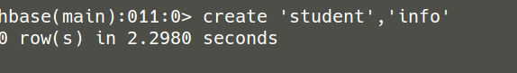
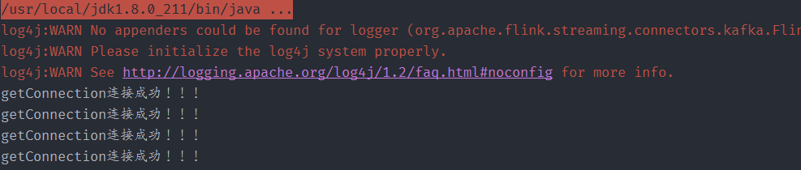
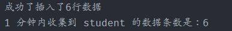
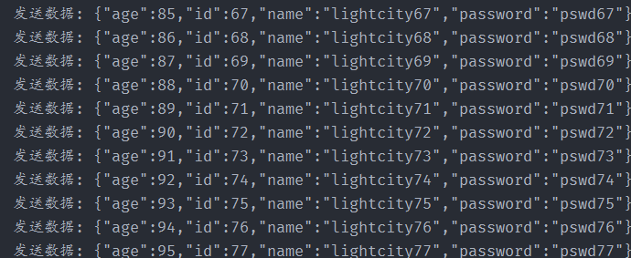
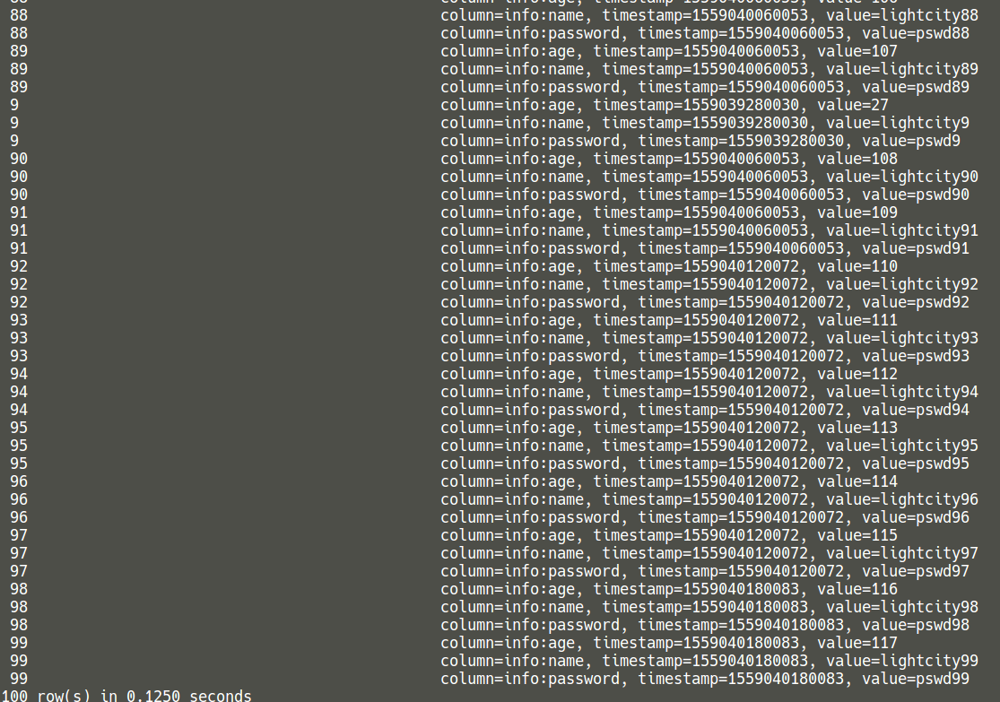
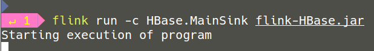
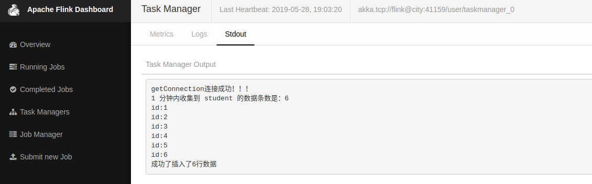

# Kafka发送数据Flink 批量写入HBase

## 1.创建maven项目

引入`flink`及`json`、`hbase`依赖。

```
<dependencies>
        <dependency>
            <groupId>org.apache.flink</groupId>
            <artifactId>flink-connector-kafka-0.11_2.11</artifactId>
            <version>1.7.2</version>
        </dependency>
        <dependency>
            <groupId>org.apache.flink</groupId>
            <artifactId>flink-streaming-java_2.11</artifactId>
            <version>1.7.2</version>
        </dependency>
        <dependency>
            <groupId>com.alibaba</groupId>
            <artifactId>fastjson</artifactId>
            <version>1.2.28</version>
        </dependency>
        <dependency>
            <groupId>org.apache.flink</groupId>
            <artifactId>flink-clients_2.11</artifactId>
            <version>1.7.2</version>
        </dependency>
        <dependency>
            <groupId>org.apache.flink</groupId>
            <artifactId>flink-hbase_2.11</artifactId>
            <version>1.7.2</version>
        </dependency>
        <!-- https://mvnrepository.com/artifact/org.apache.flink/flink-hbase -->
        <dependency>
            <groupId>org.apache.hadoop</groupId>
            <artifactId>hadoop-common</artifactId>
            <version>3.0.2</version>
        </dependency>
    </dependencies>
```

## 2.数据建模

构建kafka发送的数据模型：`student(id,name,passord,age)`。

```java
package model;

public class Student {
    public int id;
    public String name;
    public String password;
    public int age;

    public Student(){

    }
    public Student(int id, String name, String password, int age) {
        this.id=id;
        this.name=name;
        this.password=password;
        this.age=age;
    }
    @Override
    public String toString() {
        return "model.Student{" +
                "id=" + id +
                ", name='" + name + '\'' +
                ", password='" + password + '\'' +
                ", age=" + age +
                '}';
    }
    public int getId(){
        return id;
    }
    public void setId() {
        this.id=id;
    }
    public String getName() {
        return name;
    }
    public String getPassword() {
        return password;
    }

    public void setPassword(String password) {
        this.password = password;
    }

    public int getAge() {
        return age;
    }

    public void setAge(int age) {
        this.age = age;
    }

}
```

## 3.Kafka发送数据

```java
package kafka;

/**
 * 往kafka写数据
 */
public class KafkaSend {
    public static String broker_list = "localhost:9092";
    public static String topic = "student";

    public static void writeToKafka() throws InterruptedException {
        Properties props = new Properties();
        props.put("bootstrap.servers", broker_list);
        props.put("key.serializer", "org.apache.kafka.common.serialization.StringSerializer");
        props.put("value.serializer", "org.apache.kafka.common.serialization.StringSerializer");
        KafkaProducer producer = new KafkaProducer<String, String>(props);
        for (int i = 1; i <= 100; i++) {
            Student student = new Student(i, "lightcity" + i, "pswd" + i, 18 + i);
            ProducerRecord record = new ProducerRecord<String, String>(topic, null, null, JSON.toJSONString(student));
            producer.send(record);
            System.out.println("发送数据: " + JSON.toJSONString(student));  //自动调用student.toString()方法
            Thread.sleep(10*1000); //sleep 10s
        }
        producer.flush();
    }
    public static void main(String[] args) throws InterruptedException {
        writeToKafka();
    }
}
```

## 4.FlinkKafka消费数据

```java
public class MainSink {
    public static void main(String[] args) throws Exception {
        final StreamExecutionEnvironment env = StreamExecutionEnvironment.getExecutionEnvironment();

        Properties props = new Properties();
        props.put("bootstrap.servers", "localhost:9092");
        props.put("zookeeper.connect", "localhost:2181");
        props.put("group.id", "metric-group");
        props.put("key.deserializer", "org.apache.kafka.common.serialization.StringDeserializer");
        props.put("value.deserializer", "org.apache.kafka.common.serialization.StringDeserializer");
        props.put("auto.offset.reset", "latest");


        SingleOutputStreamOperator<Student> student = env.addSource(new FlinkKafkaConsumer011<>(
                "student",   //这个 kafka topic 需要和上面的工具类的 topic 一致
                new SimpleStringSchema(),
                props)).setParallelism(1)
                .map(string -> JSON.parseObject(string, Student.class)); //
        
        ....
        ....

        env.execute("flink learning connectors HBase");
    }
}
```

## 5.Flink批量写入HBase

继承`RichSinkFunction`，重写里面的方法。

主要点：

- HBase连接
- HBase BufferedMutator使用
- RichSinkFunction方法重写

```java
public class SinkToHBase extends RichSinkFunction<List<Student>> {

    private Connection conn = null;
    private static TableName tableName = TableName.valueOf("student");
    private static final String info = "info";
    private BufferedMutator mutator;


    /**
     * open() 方法中建立连接
     *
     * @param parameters
     * @throws Exception
     */
    @Override
    public void open(Configuration parameters) throws Exception {

        org.apache.hadoop.conf.Configuration config = HBaseConfiguration.create();

        config.set(HConstants.ZOOKEEPER_QUORUM, "localhost");
        config.set(HConstants.ZOOKEEPER_CLIENT_PORT, "2181");
        config.setInt(HConstants.HBASE_CLIENT_OPERATION_TIMEOUT, 30000);
        config.setInt(HConstants.HBASE_CLIENT_SCANNER_TIMEOUT_PERIOD, 30000);

        try {
            conn = ConnectionFactory.createConnection(config);

            System.out.println("getConnection连接成功！！！");
        } catch (IOException e) {
            System.out.println("HBase 建立连接失败 ");
        }


        BufferedMutatorParams params = new BufferedMutatorParams(tableName);
        //设置缓存1m，当达到1m时数据会自动刷到hbase
        params.writeBufferSize(1024 * 1024); //设置缓存的大小
        mutator = conn.getBufferedMutator(params);

    }

    @Override
    public void close() throws Exception {
        super.close();
        if (conn != null){
            conn.close();
        }
    }

    /**
     * 每条数据的插入都要调用一次 invoke() 方法
     *
     * @param value
     * @param context
     * @throws Exception
     */
    @Override
    public void invoke(List<Student> value, Context context) throws Exception {

        //遍历数据集合
        for (Student student : value) {
            Put put = new Put(Bytes.toBytes(String.valueOf(student.getId())));
            put.addColumn(Bytes.toBytes(info), Bytes.toBytes("name"), Bytes.toBytes(student.getName()));
            put.addColumn(Bytes.toBytes(info), Bytes.toBytes("password"), Bytes.toBytes(student.getPassword()));
            put.addColumn(Bytes.toBytes(info), Bytes.toBytes("age"), Bytes.toBytes(String.valueOf(student.getAge())));
            mutator.mutate(put);
            System.out.println("id:" + student.getId());
        }
        mutator.flush();
        System.out.println("成功了插入了" + value.size() + "行数据");
    }
}
```

下面代码写入FlinkKafka消费(第四步)。

```java
student.timeWindowAll(Time.minutes(1)).apply(new AllWindowFunction<Student, List<Student>, TimeWindow>() {
            @Override
            public void apply(TimeWindow window, Iterable<Student> values, Collector<List<Student>> out) throws Exception {
                ArrayList<Student> students = Lists.newArrayList(values);
                if (students.size() > 0) {
                    System.out.println("1 分钟内收集到 student 的数据条数是：" + students.size());
                    out.collect(students);
                }
            }
        }).addSink(new SinkToHBase());
```


## 6.结果展示

> 创建数据库表




> MainSink运行结果





> KafkaSend运行结果



> HBase最终数据



总共100条数据，成功！

> flink run测试结果



